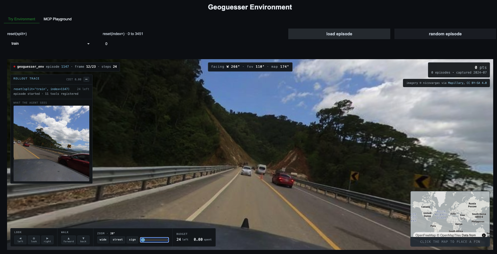

<div align="center">



<h1>GeoGuesser</h1>

<h3>Drop a model at a random street corner on Earth and ask it where it is</h3>

<p>A multi-turn visual geolocation environment, and the GRPO recipe that trained a 4B to beat eight of nine off-the-shelf models on it.</p>

<a href="https://huggingface.co/spaces/HuggingEnvs/geoguesser-env"></a>
<a href="https://huggingface.co/datasets/HuggingEnvs/geoguesser-tasks"></a>
<a href="https://github.com/huggingface/OpenEnv"></a>
<a href="https://huggingface.co/spaces/HuggingEnvs/geoguesser-article"></a>

</div>

---

## The result

A Qwen3.5-4B LoRA scores **0.6445**. It places second of eleven, ahead of gpt-5.4-mini, haiku-4.5 and every Qwen3.5 up to 397B. It loses to claude-sonnet-5 by 0.0508.

| model | mean-of-4 | best-of-4 | median error |
|---|---:|---:|---:|
| claude-sonnet-5 | 0.6952 | 0.8397 | 324 km |
| **run 1 · ckpt1000** (Qwen3.5-4B + LoRA) | **0.6445** | 0.7092 | 662 km |
| gpt-5.4-mini | 0.5732 | 0.7719 | 753 km |
| claude-haiku-4.5 | 0.5374 | 0.7014 | 939 km |
| Qwen3.5-122B-A10B | 0.5338 | 0.6987 | 767 km |
| *Qwen3.5-4B, untrained* | *0.4825* | *0.6589* | *1226 km* |
| Qwen3.5-9B | 0.4776 | 0.6873 | 1203 km |
| Qwen3.5-35B-A3B | 0.4483 | 0.6193 | 1485 km |
| Qwen3.5-27B | 0.4478 | 0.6299 | 1289 km |
| Qwen3.5-397B-A17B | 0.4466 | 0.6639 | 1420 km |
| gpt-5.4-nano | 0.3748 | 0.4895 | 2541 km |

Same 200 held-out tasks for every arm, 4 independent passes, 800 episodes each, 12-turn budget, one shared reward curve. 13,589 episodes in the table.

```bash
python eval/geoeval.py report results/raw/board-passk results/raw/passk-run1-full
```

The 4B did not get better at looking at pictures. It got better at not looking. Read [what it learned](#what-it-learned) before quoting the number.

## What this is

You are standing on a road somewhere in the world. You can turn your head, zoom in to read a shop sign, walk a few metres, and drop a pin on a world map to check what country a coordinate is in. Then you commit to a latitude and longitude and are scored on how many kilometres you were off.

That is GeoGuessr, built as an [OpenEnv](https://github.com/huggingface/OpenEnv) environment so a model can play it and you can train one to play it better.

It makes a good RL target for four reasons. The reward is continuous, so a group of eight rollouts has real spread instead of the all-zero groups a pass/fail reward gives you. The truth is a coordinate, so there is no rubric and no judge to game. The task is unsolved: the best model still misses by a median of 324 km. And it runs on CPU from a local cache, so you can debug a rollout for pennies before spending a GPU-hour.

## Layout

```
03-geoguesser/
├── env/        the environment, an installable OpenEnv package
├── train/      GRPO on HF Jobs
├── eval/       scoring
├── dataset/    building the task splits
└── results/    summaries committed, raw episodes in a bucket
```

Each directory has its own README. The four are the four things you can do: run the environment, train against it, score a model on it, or rebuild its dataset.

## Try it

Nothing to install. **[Open the Space](https://huggingface.co/spaces/HuggingEnvs/geoguesser-env)** and play a round, or point a model at it:

```bash
pip install -r eval/requirements.txt
export ANTHROPIC_API_KEY=...

python eval/geoeval.py run --env space --provider anthropic \
    --model claude-sonnet-5 --split eval --limit 5
```

To run the environment yourself, see [`env/README.md`](./env/README.md). It needs a 22 GB imagery sync and covers what the hosted copy cannot do.

## Three runs

All three are multi-turn GRPO with LoRA on 4×A100, 12-turn episodes, 8 rollouts per group. Gains are paired per task against each run's own base arm, measured in the same sweep.

| | run 1 | run 2 · 4B | run 2 · 2B | run 3 |
|---|---:|---:|---:|---:|
| `scale_rewards` | `group` | `none` | `none` | `group` |
| `beta` | 0 | 0.02 | 0.02 | 0 |
| `accum` | 2 | 4 | 4 | 4 |
| `cost_scale` | 1.0 | 0.2 | 0.2 | 0.2 |
| base | 0.4825 | 0.4768 | 0.4197 | 0.4809 |
| best checkpoint | **0.6445** | 0.5095 | 0.4860 | 0.5526 |
| **paired gain** | **+0.1620** | +0.0326 | +0.0663 | +0.0717 |
| 95% CI | ±0.0137 | ±0.0090 | ±0.0091 | ±0.0105 |
| better on | 169/200 | 124/200 | 145/200 | 139/200 |

Run 1 is the result. Run 2 turned off advantage amplification and added a KL anchor to damp run 1's instability, and lost 80% of the gain. Run 3 reverted exactly those two knobs and recovered 44%. The instability was the mechanism, not a bug.

Run 3 still falls short of run 1, and two differences remain: one task per step instead of two, and a five times larger action cost. Run 1 changed both at once, so this narrows the cause without isolating it.

The three 4B base arms agree within 0.006 across 9,590, 6,400 and 800 episodes. That is what tells us the ±0.03 drift seen in smaller sweeps is sampling noise.

Configs and commands are in [`REPRODUCE.md`](./REPRODUCE.md).

## What it learned

It learned to stop looking.

| | base | ckpt1000 |
|---|---:|---:|
| turns per episode | 6.7 | 1.1 |
| output tokens | 1062 | 66 |
| episodes that never guess | 29.5% | 0.5% |

The base model wanders, narrates, and in nearly a third of episodes never commits to a coordinate, scoring a hard zero. The trained policy takes one look and answers. Its guesses are also more accurate, 1226 km to 662 km, so this is not only a formatting fix.

The dominant term is the reward's cliff, and the effect generalises past our own checkpoints. Across the nine models we did not train, score correlates with turn count at r = -0.75, and with the share of episodes scoring exactly zero at r = -0.96. Everything past roughly 3,500 km scores exactly the same as everything else out there, so the largest available win is to stop being catastrophically wrong, and the fastest route to that is to commit to a first instinct rather than reason toward another continent.

This is not the agent we set out to build. We wanted a model that reads road signs and trained one that recalls a plausible city. That is a finding about the reward, not the model.

Note which direction it points. Run 1 carried the largest action cost of the three and collapsed hardest, to 1.1 turns. A higher cost buys a faster commit, not more careful looking. Making evidence-gathering worthwhile needs a lower cost, plus a curve with no cliff, so that a careful episode landing 4,000 km out still beats a careless one landing 12,000 km out.

Full findings, including the six measurement bugs, are in [`LEARNINGS.md`](./LEARNINGS.md).

## Published

| | |
|---|---|
| Environment | [`geoguesser-env`](https://huggingface.co/spaces/HuggingEnvs/geoguesser-env) |
| Task splits | [`geoguesser-tasks`](https://huggingface.co/datasets/HuggingEnvs/geoguesser-tasks) |
| Imagery | [`geoguesser-panos`](https://huggingface.co/buckets/HuggingEnvs/geoguesser-panos), 22 GB |
| Trained model, run 1 | [`geoguesser-qwen3.5-4b-grpo`](https://huggingface.co/HuggingEnvs/geoguesser-qwen3.5-4b-grpo) |
| Trained model, run 3 | [`geoguesser-qwen3.5-4b-grpo-v3`](https://huggingface.co/HuggingEnvs/geoguesser-qwen3.5-4b-grpo-v3) |
| Training curves | [`geoguesser-trackio`](https://huggingface.co/spaces/HuggingEnvs/geoguesser-trackio), all four runs |
| Write-up | [`geoguesser-article`](https://huggingface.co/spaces/HuggingEnvs/geoguesser-article), the reasoning behind every decision here |

Both trained adapters are on the Hub, and everything is gathered in the [GeoGuesser Env collection](https://huggingface.co/collections/HuggingEnvs/geoguesser-env-6a969f8db267fe0e85fa1ab6).

A reproduction that disagrees with the tables above is a bug report we want.
