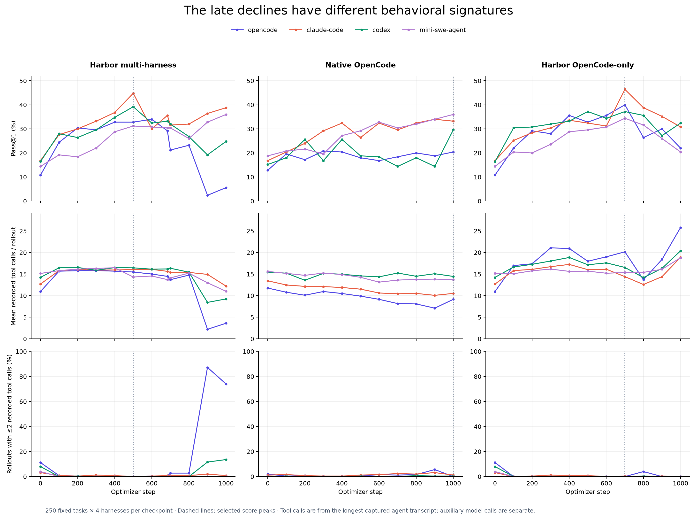
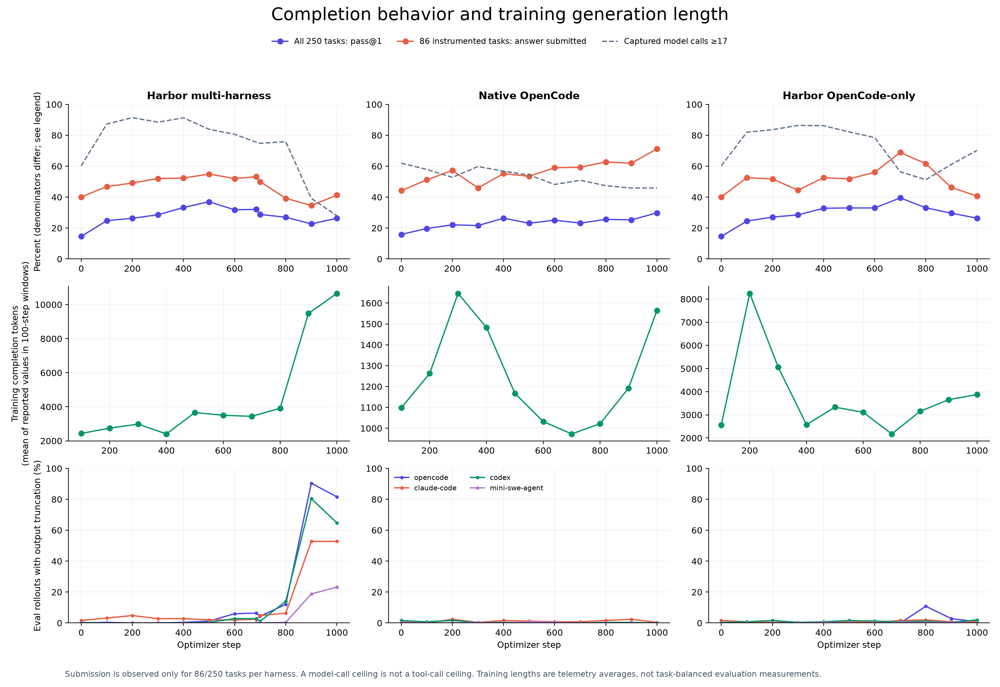
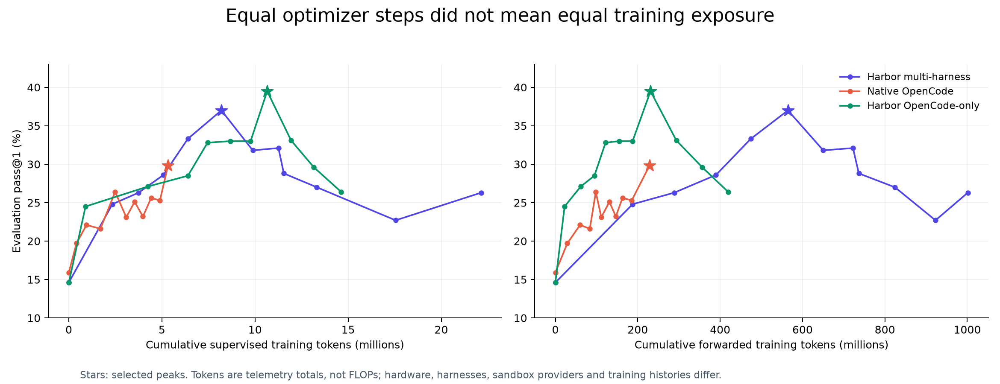

# Three-run training and evaluation analysis

September 17, 2026. Qwen3.5-2B; 250 fixed test tasks and four evaluation harnesses.

**The two late declines have different signatures.** Multi-harness training develops long, often truncated responses and loses effective tool use, especially in OpenCode. Harbor OpenCode-only continues using tools but spends more calls, repeats more work, and submits fewer answers. Native OpenCode shows neither extreme and finishes at its best aggregate checkpoint.

I also found a concrete resume problem: the multi-harness continuation largely revisited tasks already trained on. These observations identify useful diagnostics; they do not establish one causal explanation for all score changes.

The [training companion](TRAINING.md) adds a census of 13,625 optimizer-admitted rollouts,
with token counts checked against receipts, per-harness tool use, context overhead and
zero-variance groups. See [the concise results overview](../../results.md) for the combined findings.

## Evidence and scope

The analysis reconstructs **33,000 unique accepted evaluation cells**, represented by 34 checkpoint cohorts because the two Harbor runs share the same 1,000-cell baseline. Every reconstructed harness score matches its accepted score file, and every task index matches the frozen manifest. Training analysis uses all 3,000 optimizer-step metric records, coverage reports, frozen schedules, and available per-rollout optimizer receipts.

| Run | Baseline | Best measured checkpoint | Final checkpoint 1,000 |
| --- | ---: | ---: | ---: |
| Harbor multi-harness | 14.6% | 500: **37.0%** | 26.3% |
| Native OpenCode | 15.9% | 1,000: **29.8%** | 29.8% |
| Harbor OpenCode-only | 14.6% | 700: **39.5%** | 26.4% |

“Tool calls” below means distinct call IDs in the longest captured agent transcript. This transcript can omit discarded branches; it is not a billable-request counter. “Model calls” comes from the capture graph and includes auxiliary calls. A model response can emit several tools, so the 17-model-call ceiling does not imply a 17-tool-call ceiling.

## 1. Multi-harness regression is concentrated in OpenCode, with output truncation

From checkpoint 500 to 1,000:

| Evaluation harness | Pass@1 | Mean recorded tool calls | Rollouts with output truncation |
| --- | ---: | ---: | ---: |
| OpenCode | 32.8% → **5.6%** | 15.48 → **3.61** | 3/250 → **204/250** |
| Claude Code | 44.8% → 38.8% | 16.06 → 12.22 | 5/250 → 132/250 |
| Codex | 39.2% → 24.8% | 16.45 → 9.24 | 1/250 → 162/250 |
| Mini-SWE-Agent | 31.2% → **36.0%** | 14.33 → 11.00 | 0/250 → 58/250 |

OpenCode accounts for **68 of the 107 net lost successful cells**, about 64% of the aggregate decline. At checkpoint 900 it is worse: 2.4% success, 2.22 tool calls on average, and 87.2% of rollouts have at most two recorded tool calls. The final checkpoint has 74.0% in that category.

Across all four harnesses, output truncation rises from **9/1,000 to 556/1,000 rollouts**. At the final checkpoint, truncated rollouts score 9.9%, versus 46.8% for those without a truncation warning. This is an association: hard or poorly handled tasks can cause both long outputs and failure.

Directly inspected examples read a CSV once, then produce a long explanatory response that ends with `finish_reason="length"` at **4,096 output tokens**, without executing the calculation or writing the required answer. A few checkpoint-900 examples instead emit tool-like XML or JSON as plain text, with no parsed tool call. Thus the low call count should not be interpreted as successful efficiency.

**Budget mismatch is a plausible contributor.** The evaluation manifest caps each response at 4,096 output tokens. Saved late training captures contain individual responses up to **16,384 tokens**. The complete admitted-rollout census finds responses longer than 4,096 in **182/485 (37.5%)** rollouts at steps 901–1,000, versus **10/512 (2.0%)** at steps 401–500. Whole-rollout completion tokens rise **3,521 → 9,480** over those windows. This replaces the earlier small-sample estimate. Worker completion-length telemetry averages 3,658 → 10,657 because it describes generated rollouts and uses different aggregation; [training metric definitions](TRAINING.md#what-is-counted) explain the distinction.

This suggests a policy increasingly incompatible with the evaluation budget. It does **not** show that a larger budget would recover the score; some inspected responses repeat reasoning or invent facts rather than making progress.

## 2. OpenCode-only declines through longer tool loops and missing submissions

Harbor OpenCode-only, checkpoint 700 → 1,000:

| Measure | Checkpoint 700 | Checkpoint 1,000 |
| --- | ---: | ---: |
| Overall pass@1 | 39.5% | 26.4% |
| Mean recorded tool calls, all harnesses | 16.62 | 20.97 |
| Mean exact repeated calls | 2.09 | 3.03 |
| Rollouts reaching at least 17 captured model calls | 56.4% | 70.2% |
| Answer submission, instrumented subset | 68.9% | 40.7% |
| Output-truncated rollouts | 7/1,000 | 9/1,000 |

Submission is observable for **86 of the 250 tasks per harness**, or 344 cells. It must not be reported as a whole-test-set rate. Of 73 previously correct cells in this subset that become incorrect, **64 no longer submit an answer**.

On matched task/harness cells that regress, tool calls rise from **15.26 to 22.48** on average. OpenCode itself goes from 20.16 to 25.80 calls while its score falls from 40.0% to 22.0%. Mini-SWE-Agent reaches at least 17 captured model calls on **95.6%** of final rollouts.

The signature is continued work without reliable completion, rather than the widespread output truncation in the multi-harness model. Context-budget exhaustion increases too, from 7 to 25 cells, but is too rare to account for the entire decline. Exact repetition is only a proxy for wasted work: repeating a command can sometimes be useful.

## 3. The multi-harness resume replayed nearly the entire continuation's task set

The continuation at step 684 resumed with schedule offset **230**. The previous allocation had already trained many later groups, but group 230 was the first hole in its completed-group set.

The saved trainer code writes only `dataset_start_index + first_untrained` to `rollout_state.json`; it does not persist the later completed-group set. Resuming therefore schedules those later tasks again.

Evidence: frozen checkpoint-saving code (`experiments/async_grpo_harbor_data_agent/logs/multi4-long-prod-cont-20260915/source-snapshot/trl/trl/experimental/async_grpo/async_grpo_trainer.py:1798`, local evidence), continuation resume audit (`experiments/async_grpo_harbor_data_agent/logs/multi4-long-prod-cont-20260915/job-80608/audit/resume.json`, local evidence), and optimizer receipts (`experiments/analysis-three-runs-20260917/optimizer_rollouts.csv`, local evidence).

Optimizer receipts confirm that steps 685–1,000 admitted **1,579 fresh rollouts**, of which **1,575 used previously seen tasks**. About **99.8% of supervised tokens** in that segment came from already-seen tasks. Its 203 task IDs add only one new task to the previous detailed optimizer receipts. Coverage reports count 202 stable tasks for the segment because their callback waits for an additional optimizer boundary.

This is task replay, not replay of cached model responses. It materially changes data exposure and is a credible contributor to later over-specialization. **It cannot explain the initial 500 → 600 drop**, which occurred before this restart. OpenCode-only also declines without a restart, so resume replay is not a universal explanation.

Before another resumed run, preserve completed absolute group IDs and explicitly handle unfinished groups; simply advancing to the largest group ID would silently skip gaps.

## 4. Training on one harness transferred to other harnesses

Harbor OpenCode-only reaches **46.4% on Claude Code** at checkpoint 700, above its 40.0% on OpenCode. All four harnesses improve substantially from the shared baseline.

Native OpenCode's final checkpoint scores:

| Evaluation harness | Baseline | Final | Gain |
| --- | ---: | ---: | ---: |
| OpenCode | 12.8% | 20.4% | +7.6 pp |
| Claude Code | 16.8% | 33.2% | +16.4 pp |
| Codex | 15.2% | 29.6% | +14.4 pp |
| Mini-SWE-Agent | 18.8% | 36.0% | +17.2 pp |

This contradicts the simple expectation that single-harness training mainly improves that same harness. It is consistent with transfer of task-solving behavior combined with different harness prompting and tool interfaces. These runs do not isolate the marginal benefit of multi-harness training, because exposure, backends and training histories differ.

## 5. Equal optimizer steps were not equal data or compute budgets

| Run | Unique training tasks in coverage logs | Supervised tokens | Forwarded tokens |
| --- | ---: | ---: | ---: |
| Harbor multi-harness | 482/1,000 | 22.15M | 1,001.32M |
| Native OpenCode | 566/1,000 | 5.33M | 228.41M |
| Harbor OpenCode-only | 523/1,000 | 14.63M | 419.43M |

Native OpenCode used about **one quarter of the multi-harness supervised-token count**. It also finishes with lower recorded tool use: 11.97 calls per evaluation rollout, versus 20.97 for Harbor OpenCode-only. This is a useful efficiency observation, but wall-time comparisons are confounded by E2B versus Daytona, serving allocations and retries.

The 1,000-step cap stopped all three before full task coverage. A future controlled comparison should specify both the task exposure target and supervised-token budget. “1,000 steps on the same 1,000-task dataset” is insufficient.

## 6. Balanced harness rollouts produced unequal token weighting

Detailed optimizer receipts are available from multi-harness step 31 onward:

| Harness | Share of admitted rollouts | Share of training rows | Share of supervised tokens |
| --- | ---: | ---: | ---: |
| OpenCode | 25.2% | 11.4% | 18.3% |
| Claude Code | 24.8% | **77.3%** | **35.3%** |
| Codex | 24.6% | 5.3% | 31.1% |
| Mini-SWE-Agent | 25.4% | 5.9% | 15.3% |

The harness schedule was balanced in rollout count. Claude's prompt forks greatly increased row count and repeated context, but **77.3% of rows does not mean 77.3% of the gradient**: these runs use supervised-token normalization. Token shares better describe loss exposure, though actual gradient contributions also depend on advantages, clipping and token gradients.

This supports measuring rollout, row, context-token and supervised-token shares separately. It does not establish that Claude's row count caused the decline.

## 7. Difficulty and harness agreement reveal more than the average

- Multi-harness easy-task pass@1 drops **72.7% → 42.4%** from peak to final, while hard-task pass@1 drops 16.4% → 13.4%. This is not merely a loss on difficult tasks. There are only 33 distinct easy tasks, evaluated under four harnesses.
- OpenCode-only declines across all three difficulty levels: easy 71.2% → 59.1%, medium 44.5% → 30.3%, hard 23.0% → 10.9%.
- At the multi-harness peak, **45 tasks succeed under all four harnesses**; at the final checkpoint, only **7** do. Tasks solved by at least one harness fall less sharply, from 141 to 129. Harness consistency erodes more than the set of tasks solvable by any harness.
- OpenCode-only checkpoint 700 solves 149/250 tasks under at least one harness (59.6%); native final solves 134/250 (53.6%). These are retrospective four-harness oracle rates, **not pass@1** and not deployable routing policies.

## 8. The declines are clear; the ranking of the two peaks is not

Paired bootstrap intervals resample the 250 task IDs, keeping each task's four harness outcomes together:

| Comparison | Score change | Conditional 95% interval |
| --- | ---: | ---: |
| Multi-harness 500 → 1,000 | −10.7 pp | −14.1 to −7.4 pp |
| OpenCode-only 700 → 1,000 | −13.1 pp | −16.6 to −9.7 pp |
| Multi-harness 500 → OpenCode-only 700 | +2.5 pp | −0.6 to +5.7 pp |

The late declines are larger than the task-level variability captured by this calculation. The best-score difference does not clearly separate the runs. These intervals condition on observed checkpoints and attempts: they do not account for selecting the best of many checkpoints, another sampling seed, another training seed, or protocol differences.

## What is ruled out, and what remains uncertain

- Recorded gradient norms are finite throughout; observed maximum staleness never exceeds four. There is no obvious numerical blow-up or staleness-limit violation in these metrics. Neither check proves healthy policy learning.
- All accepted eval cohorts pass their existing TiTO and version gates. TiTO validates token identity and alignment; it cannot guarantee useful tool behavior or improving rewards.
- **All three comparison trainers use binary correctness.** Native raw rollout artifacts retain an efficiency bonus, but `ComparisonSession.verify()` removes it before training. The preliminary suspicion of different reward objectives was rejected after inspecting the frozen adapter.
- The native run uses Daytona and the Harbor runs use E2B. Baselines are separate measured cohorts. Multi-harness also has several resumed allocations and early recipe changes.
- The published metric retains the experiment's “pass@1” name, with first graded attempt selection and retries for ungraded failures. Native baseline logs show preceding ungraded attempts for 830 cells; multi-harness checkpoint 500 has 65 such cells and final has 205. These counts exclude skip markers and are not necessarily unique infrastructure outages. Multi-harness 900/1,000 also have documented verifier-budget reconciliation. Uniform first-attempt accounting is needed for a stronger controlled comparison.

## Recommended next work

1. **Fix and test resume task accounting first.** Preserve completed groups and unfinished work across restarts. Add a test with an early missing group and later completed groups; verify the latter are not rescheduled unintentionally.
2. **Run a small, separately labeled output-budget diagnostic.** Compare multi-harness checkpoints 500 and 1,000 on the same tasks and harness with 4,096 versus 16,384 output tokens. Keep the canonical evaluation scores unchanged. Measure submission, truncation and actual executed tool results, not just reward. Prefer a development split for subsequent tuning.
3. **Investigate completion discipline for OpenCode-only.** Compare peak/final trajectories on lost tasks: repeated calls, unbounded file reads, context exhaustion and failure to write the answer. Increasing the tool budget alone is not supported by these results.
4. **Track behavior during training and evaluation.** Add per-harness output-truncation rate, submission rate, recorded/executed tool calls, repeated-call fraction, completion tokens, task coverage and cumulative supervised tokens. Keep them separate from the headline reward.
5. **Make the next ablation controlled.** Same backend, output budgets, task exposure, capture/agent filters and loss normalization; compare multiple seeds and choose checkpoints on validation data. Measure token-weighted harness exposure before changing weighting.

## Artifacts and reproduction

- [Harness/checkpoint metrics](by_harness.csv), [difficulty metrics](by_difficulty.csv), [outcome-conditioned metrics](by_outcome.csv), [output warnings](capture_warnings.csv).
- [Paired score differences](paired_differences.csv), [harness agreement](harness_complementarity.csv), [training windows](training_windows.csv), [training exposure](evaluation_vs_training_exposure.csv).
- [Training analysis](TRAINING.md), [admitted-rollout metrics](training_behavior_windows.csv), [training harness breakdown](training_behavior_by_harness.csv), [optimizer accounting](training_accounting.csv), [training figure](training_diagnostics.png).
- Local analysis code and trace hashes: `experiments/analysis-three-runs-20260917/` (`extract.py`, `training.py`, `analyze.py`, `provenance.json`).
- `sampled_training_lengths.json` records the fixed training sample. `training_lineage.csv` and `optimizer_rollouts.csv` support the resume and weighting calculations. Raw captures and accepted scores were not changed.

Run the three scripts in order with `.venv312/bin/python`. Outputs remain local; no new inference or training jobs were launched for this analysis.
