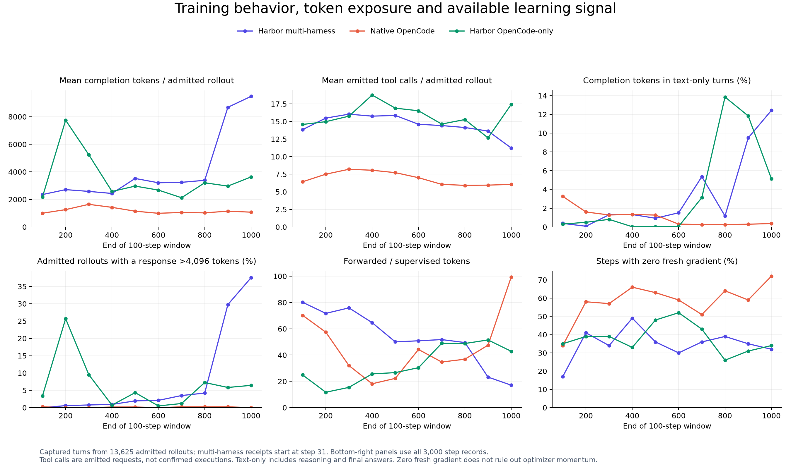

# Training behavior and its relation to evaluation

September 17, 2026. Companion to the [evaluation analysis](REPORT.md).

The training-side evidence supports different failure modes in the two Harbor runs: multi-harness generates much longer responses with fewer tool calls, while OpenCode-only increases work without reliably finishing. Native OpenCode uses substantially fewer supervised tokens. These are observations from the completed runs, not an isolated comparison of training algorithms.

## What is counted

- **Optimizer telemetry:** all 3,000 step records, including supervised/forwarded tokens, gradient norms and timing.
- **Admitted rollouts:** 13,625 saved captures matched to optimizer receipts: 5,013 multi-harness, 4,493 native OpenCode and 4,119 Harbor OpenCode-only. Multi-harness receipts begin at step 31; its first 30 steps have telemetry but are excluded from capture-level comparisons.
- **Tool calls:** parsed tool-call emissions across retained agent turns. They are requests, not proof of successful execution. Auxiliary and discarded turns are excluded. This differs from the evaluation report's longest-transcript counter, which may omit earlier branches.
- **Completion tokens:** captured output IDs across those turns. **Supervised tokens** are positions selected by the loss mask. **Forwarded tokens** include context and completion processed by the trainer, including repeated context across forked rows; they are neither unique tokens nor serving-token bills.

Every capture's masked token count is checked against its optimizer receipt. All 13,625 agree. Per-rollout averages below count each admitted rollout once. The older `tools/call_frequency` and reward dashboard metrics average over training rows inside microbatches, then logging windows; they can overweight rollouts with more rows. Worker completion-length telemetry also includes generated rollouts independently of their later admission. The datasets and denominators must remain distinct.

## Token growth in multi-harness training

Comparing optimizer steps **401–500** with **901–1,000**:

| Measure, admitted rollouts | Earlier window | Final window |
| --- | ---: | ---: |
| Rollouts | 512 | 485 |
| Mean completion tokens | 3,521 | 9,480 |
| Median completion tokens | 2,359 | 6,776 |
| Mean emitted tool calls | 15.86 | 11.24 |
| At least one response longer than 4,096 tokens | 2.0% | 37.5% |
| Completion tokens in turns without a tool call | 0.9% | 12.4% |
| Mean binary training reward | 37.5% | 39.4% |
| Fixed-test pass@1 at window end | 37.0% | 26.3% |

The median grows too, so this is not just a few enormous outliers. More tokens accompany fewer actions, and slightly higher reward on the changing training cohort accompanies lower held-out performance. Task replay after the step-684 resume further complicates the training reward.

The worker's previously reported mean completion length was 3,658 → 10,657. That remains a valid telemetry summary, but the table uses the cleaner once-per-admitted-rollout measure. The full capture census supersedes the earlier small sample for estimating how frequently training responses exceed the eval limit.

Most late completion tokens still occur in turns that eventually emit a tool call. Inspected successful training examples contain a long explanation followed by a short tool request. Under a shorter output limit, that request may never be emitted. This is a testable explanation for the evaluation's long text responses, low tool-call count and high truncation rate; it does not prove that increasing the eval cap would restore accuracy.

Per-harness token inflation is broad, despite a balanced admitted-rollout mix:

| Training harness | Completion tokens, mean | Tool calls, mean | Final rollouts with a response >4,096 tokens |
| --- | ---: | ---: | ---: |
| OpenCode | 2,583 → 5,602 | 14.82 → 7.79 | 38.1% |
| Claude Code | 5,924 → 14,148 | 17.22 → 12.68 | 51.3% |
| Codex | 4,199 → 11,193 | 16.44 → 14.13 | 37.5% |
| Mini-SWE-Agent | 1,603 → 7,110 | 15.11 → 10.37 | 24.2% |

These compare the same two step windows, not matched training tasks. In particular, task replay and changing difficulty prevent interpreting the training-reward changes as generalization gains.

Length growth also occurs among **successful** admitted rollouts: their mean completion
length rises **2,453 → 9,084 tokens**. It is not confined to failed attempts. This makes
train/eval budget compatibility worth testing even when training reward appears healthy.

## Harbor OpenCode-only: more output and actions near the end

Comparing steps **601–700**, ending at the best evaluated checkpoint, with **901–1,000**:

| Measure, admitted rollouts | Peak window | Final window |
| --- | ---: | ---: |
| Rollouts | 420 | 404 |
| Mean completion tokens | 2,122 | 3,631 |
| Median completion tokens | 1,552 | 2,102 |
| Mean emitted tool calls | 14.63 | 17.43 |
| Mean retained agent turns | 11.70 | 11.49 |
| At least one response longer than 4,096 tokens | 1.2% | 6.4% |
| Mean binary training reward | 46.2% | 39.4% |
| Fixed-test pass@1 at window end | 39.5% | 26.4% |

Tool calls rise without more model turns: a response can request multiple tools. The
same broad increase in work appears on the fixed evaluation set, where average tool
calls rise 16.62 → 20.97 and submission declines sharply. Training and evaluation
do not agree on every diagnostic: mean exact repetitions fall 3.82 → 3.03 in these
training windows, while rising in eval. Different tasks and harness mixtures matter.

Training length is also non-monotonic: steps 101–200 average 7,750 tokens per admitted
rollout, higher than the final window, and the model later recovers. Length alone is
therefore not a sufficient explanation or stopping rule.

## Native OpenCode: short outputs, but growing context overhead

From steps 401–500 to 901–1,000, admitted native OpenCode rollouts average **1,145 → 1,075 completion tokens** and **7.72 → 6.05 emitted tool calls**. None of the final window's 402 admitted rollouts contains a response longer than 4,096 tokens. Its final held-out score is its highest measured, 29.8%.

There is nevertheless a late efficiency regression: **rows per admitted rollout grow 1.91 → 4.56**, and forwarded tokens per supervised token grow **22.3× → 99.4×**. Mean forward/backward time rises **4.69 → 15.96 seconds per step**. Short outputs therefore do not guarantee cheap training when history forks into more context-bearing rows. Overall step time stays approximately flat because recorded rollout waiting time falls; this is not evidence of equal GPU work.

## Compute exposure and zero-variance groups

| Full run, 1,000 steps | Supervised tokens | Forwarded tokens | Forwarded / supervised | Zero-fresh-gradient steps |
| --- | ---: | ---: | ---: | ---: |
| Harbor multi-harness | 22.15M | 1,001.32M | 45.2× | 349/1,000 |
| Native OpenCode | 5.33M | 228.41M | 42.9× | 583/1,000 |
| Harbor OpenCode-only | 14.63M | 419.43M | 28.7× | 380/1,000 |

The context overhead is real, but context is required for correct conditional training; these ratios do not mean that all masked tokens are avoidable waste. Prompt forks can increase repeated context substantially.

Every recorded zero-gradient step coincides with zero within-group reward standard deviation. With binary rewards, a group whose scorable rollouts all agree has zero GRPO advantage and supplies no fresh learning signal. Different uniform groups can share a step, so a zero-gradient step can still have an intermediate average reward.

Those steps consume **35.0%, 58.8% and 39.1% of forwarded tokens**, respectively, for multi-harness, native and Harbor OpenCode-only. Native's final 100 steps include 72 zero-gradient steps. This suggests investigating rejection of zero-advantage groups before expensive training forwards, while preserving coverage, scheduling and checkpoint semantics. Generation and grading costs would remain. **Zero fresh gradient does not mean unchanged weights:** optimizer momentum and weight decay can still act.

## Measurement cautions

- Training rows are not independent task examples. Claude's 77.3% row share corresponds to 35.3% of supervised tokens in the receipt-covered multi-harness segment, not 77.3% of the gradient.
- `completions/clipped_ratio` in the frozen worker checks whether the **last** output token is EOS/pad. It does not directly measure whether **any** earlier response was truncated, or whether a response exceeds the evaluation's 4,096-token cap. The new capture metrics record those separately.
- Tool-failure telemetry infers errors from result text; it is not a structured count of sandbox failures. Emitted calls and successful executions should be logged separately in future runs.
- A token can be selected by the loss mask yet have zero advantage. “Supervised tokens” is accounting for eligible positions, not a count of nonzero gradient contributions.
- Task mix changes throughout training. Training rewards and per-window rollout statistics are not repeated measurements on a fixed dataset. The evaluation cohorts are fixed, subject to the [documented historical retry policy](REPORT.md#what-is-ruled-out-and-what-remains-uncertain).

## Reproduction



[Per-window capture metrics](training_behavior_windows.csv) ·
[Harness breakdown](training_behavior_by_harness.csv) ·
[Success/failure breakdown](training_behavior_by_outcome.csv) ·
[Optimizer accounting](training_accounting.csv) ·
[Original step-metric aggregation](training_step_diagnostics.csv)

Use Python with `orjson`, `pandas`, `numpy` and `matplotlib`. The evidence directory must contain the frozen `optimizer_rollouts.csv`, `training_lineage.csv`, `training_metrics.csv` and the saved captures referenced by the lineage. No model loading or GPU jobs are required.

```bash
python training_behavior.py --evidence /path/to/analysis-three-runs-20260917 --workers 2
python summarize_training.py --evidence /path/to/analysis-three-runs-20260917
```

The extractor saves per-rollout counts and source hashes in the evidence directory. The summarizer writes aggregate CSVs and `training_diagnostics.png` beside this document. Local raw evidence is preserved under `experiments/analysis-three-runs-20260917/`; it is not copied into the repository.
