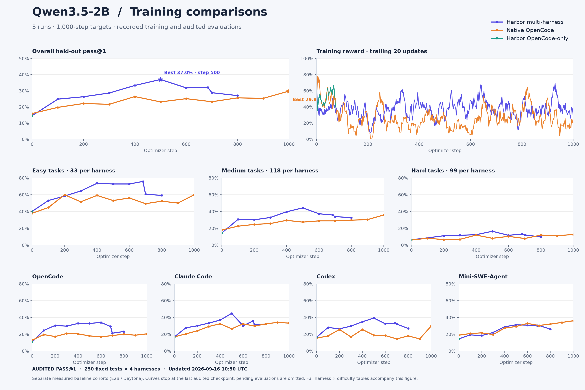

# Data Agent: completed training and evaluation

Updated September 17, 2026. Three async Qwen3.5-2B runs reached 1,000 optimizer steps.
Every scheduled 100-step checkpoint evaluation is complete: 250 fixed test tasks ×
four harnesses, pass@1. The test set contains 33 easy, 118 medium and 99 hard tasks.

| Run | Baseline | Best measured checkpoint | Final step 1,000 |
| --- | ---: | ---: | ---: |
| Harbor multi-harness | 14.6% | **37.0% at 500** | 26.3% |
| Native OpenCode | 15.9% | **29.8% at 1,000** | 29.8% |
| Harbor OpenCode-only | 14.6% | **39.5% at 700** | 26.4% |

[Every checkpoint, harness and difficulty](reports/async-comparison-20260916/REPORT.md) ·
[Public Trackio comparison](https://huggingface.co/spaces/HuggingEnvs/data-agent-training-comparison-trackio)

## What training and evaluation show

**Multi-harness produces longer responses but takes fewer actions.** Between training
steps 401–500 and 901–1,000, completion tokens per admitted rollout grow **3,521 → 9,480**,
while emitted tool calls fall **15.86 → 11.24**. In the final window, 37.5% of admitted
rollouts contain a response longer than the evaluation's 4,096-token output cap.
At evaluation, output-truncated rollouts rise **9/1,000 → 556/1,000** from peak to final.
OpenCode accounts for about 64% of the net lost successful evaluations. Budget mismatch
is a plausible contributor, not a proven explanation for the whole decline.

**Harbor OpenCode-only continues working but finishes less reliably.** Peak-to-final
eval tool calls rise **16.62 → 20.97**, while submission falls **68.9% → 40.7%** on the
86-task subset with explicit submission instrumentation. Output truncation remains rare.
Training also shows longer outputs (**2,122 → 3,631 tokens**) and more tool use
(**14.63 → 17.43 calls**) per admitted rollout, comparing steps 601–700 with 901–1,000.

**Native OpenCode finishes at its best aggregate score with shorter training outputs.**
Its final 100 steps average 1,075 completion tokens and 6.05 emitted tool calls per
admitted rollout. However, late prompt forking increases context overhead: forwarded
tokens per supervised token rise **22.3× → 99.4×** between steps 401–500 and 901–1,000.

**One-harness training transfers to other harnesses.** Harbor OpenCode-only's best
checkpoint scores 46.4% under Claude Code and 40.0% under OpenCode. Native OpenCode
improves all four evaluation harnesses; its largest gains are outside OpenCode.

## Training accounting changes the interpretation

| Run | Distinct tasks covered | Supervised tokens | Forwarded tokens | Zero-fresh-gradient steps |
| --- | ---: | ---: | ---: | ---: |
| Harbor multi-harness | 482 | 22.15M | 1,001.32M | 349/1,000 |
| Native OpenCode | 566 | 5.33M | 228.41M | 583/1,000 |
| Harbor OpenCode-only | 523 | 14.63M | 419.43M | 380/1,000 |

The 1,000-step cap did not cover the whole 1,000-task training pool. Equal optimizer
steps also did not provide equal token exposure. Zero-gradient steps coincide with
zero within-group reward variance and supply no fresh GRPO contrast; optimizer
momentum may still update weights.

The multi-harness resume after step 684 revisits previously seen tasks in **1,575 of
1,579 admitted rollouts**. The saved schedule cursor does not preserve later completed
groups. This changes late data exposure but cannot explain the initial decline after
step 500, which happened before that restart.

## Next experiments

1. Fix and test resume accounting for out-of-order completed groups and unfinished work.
2. Diagnose the train/eval output-budget mismatch on a small, separately labeled cohort;
   preserve the canonical scores. Check submission and executed actions, not just reward.
3. Track per-harness tokens, calls, submission, truncation, context duplication, task
   coverage and zero-advantage groups. Compare future runs at matched exposure and budgets.

This is an observational comparison. Backend, rollout filtering, training histories and
historical eval retries differ. The 39.5% versus 37.0% peak difference is not clearly
separated by paired task-level uncertainty. All three trainers use binary correctness;
native raw efficiency bonuses are removed before training.

Evidence: [evaluation analysis and limitations](reports/three-run-analysis-20260917/REPORT.md),
[training token/tool analysis and reproduction](reports/three-run-analysis-20260917/TRAINING.md).
Raw captures and accepted scores are unchanged.

[Short message for sharing](reports/three-run-analysis-20260917/TLDR.md)

## Earlier SETA and infrastructure snapshot

The following September 16 snapshot is retained for SETA results and qualification provenance. Its pending async evaluations were subsequently completed; use the September 17 tables above for the three async runs.

# Historical data-agent results

Snapshot: **2026-09-16 UTC**. Metric: **pass@1** on the fixed 250-task test set (33 easy, 118 medium, 99 hard). Each accepted async checkpoint has 250 tasks × four harnesses = **1,000 first-graded cells**. SETA uses its native bash/SETA evaluator, 250 cells.

[Public artifact index](https://huggingface.co/datasets/HuggingEnvs/data-agent-experiment-results): code, environments, dashboards, report downloads, qualification evidence and published checkpoints. Credential-bearing raw evidence stays private; redacted public copies are explicitly marked.

The [complete report](results/2026-09-16/REPORT.md) includes training history and **harness × difficulty at every accepted checkpoint**. [CSV](results/2026-09-16/checkpoint_scores.csv) provides the underlying correct/graded counts; [snapshot](results/2026-09-16/snapshot.json.gz) retains audited provenance and training metrics. The [live Trackio dashboard](https://huggingface.co/spaces/HuggingEnvs/data-agent-training-comparison-trackio) may contain newer observations.

| Checkpoint | Harbor multi-harness | Native OpenCode training, four-harness eval | SETA native eval |
| --- | ---: | ---: | ---: |
| Base | 14.6% | 15.9% | 18.8% |
| 100 | 24.8% | 19.7% | 34.8% |
| 150 (final SETA) | — | — | **38.0%** |
| 200 | 26.3% | 22.1% | — |
| 300 | 28.6% | 21.6% | — |
| 400 | 33.3% | 26.4% | — |
| 500 | **37.0%** | 23.1% | — |
| 600 | 31.8% | 25.1% | — |
| 684 (recovery) | 32.1% | — | — |
| 700 | 28.8% | 23.2% | — |
| 800 | 27.0% | 25.6% | — |
| 900 | Incomplete | 25.3% | — |
| 1000 | Incomplete | **29.8%** | — |

Harbor multi-harness and native OpenCode reached 1,000 training steps. Native OpenCode's final four-harness evaluation is complete at 29.8%; Harbor multi-harness still lacks accepted step-900/1000 scores. SETA was intentionally stopped after a verified checkpoint 150; its final evaluation completed at **38.0%**. Harbor OpenCode-only is a new run in progress; no post-training checkpoint score is claimed here.

The async report/CSV/figure retain their 10:50 UTC snapshot. SETA's later result has a separate [checkpoint-150 receipt](results/2026-09-16/seta-checkpoint-150.json), including the verified model manifest, complete scoring and job identity.

## Baselines and difficulty

| Measured cohort | Easy | Medium | Hard | Overall |
| --- | ---: | ---: | ---: | ---: |
| Harbor multi-harness base (E2B) | 53/132 = 40.2% | 68/472 = 14.4% | 25/396 = 6.3% | 146/1000 = 14.6% |
| SETA base (HF Job / Daytona) | 14/33 = 42.4% | 27/118 = 22.9% | 6/99 = 6.1% | 47/250 = 18.8% |
| SETA checkpoint 100 | 23/33 = 69.7% | 45/118 = 38.1% | 19/99 = 19.2% | 87/250 = 34.8% |
| SETA checkpoint 150 | 28/33 = 84.8% | 49/118 = 41.5% | 18/99 = 18.2% | 95/250 = 38.0% |

Native OpenCode's **standalone** base evaluation scored **21/250 = 8.4%**. That is a different protocol from the **15.9%** four-harness Harbor/Daytona baseline used for its checkpoint comparison. Do not mix these denominators or relabel one cohort as the other. The shared Harbor OpenCode-only run reuses the recorded E2B base cohort and has no new measured gain yet.

## What the runs established

- Exact captured prompt/completion IDs, real aligned log probabilities and authoritative loss masks are usable across the selected harnesses. Lossless forks preserve supervision when prompts change; more rows still affect token cost and weighting.
- The async recipe admits complete rollout groups and checks retained supervision against capture records. The optimizer, checkpoint, upload and remote-resume paths have real GPU evidence.
- The native OpenCode baseline completed 250 tasks at local concurrency 50. HF SETA exercised 8, 32 and 53 concurrent slots. Earlier scaling failures are preserved; the reproduction defaults to **35** on Hub infrastructure.
- Checkpoint evaluations run on separate GPUs, with fixed test identities and first-graded results. A graded zero is never replaced by a retry.
- Task parsing now preserves explicit zero numerical tolerances. Native baseline qualification deterministically rechecks the unchanged submitted answers and frozen grading parameters.

Historical qualification receipts: native optimizer smoke **80593**, local SETA **80555**, HF SETA **6aa9a487f76d6a098a70e3d2**; independent checkpoint smokes **80603**, **80576**, and **6aa9af55f76d6a098a70e52d** respectively. These are evidence for their recorded source snapshots, not substitutes for qualifying a changed bundle. Fresh PR qualification is recorded separately in [validation.md](results/validation.md).

## Limits of the comparison

Infrastructure, harness protocols, batching and recipe versions changed during bring-up. Async atomic batching and synchronous GRPO/DAPO have different scheduling and token accounting. These curves are observational; they do not isolate a causal effect of sync versus async or multi-harness versus one harness. Training reward is a sampled training signal, not held-out pass@1.

Scores only enter the accepted table after complete coverage and their recorded TiTO/version/provenance checks. The Harbor decline after step 500 is observed; this report does not assign a cause without a controlled ablation. Failed or incomplete cohorts remain visible in the snapshot's pending section and are not estimated.
