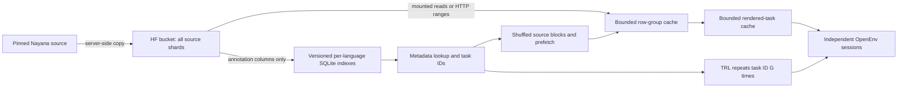

# 05 · Multilingual OCR

**Serve the complete Nayana corpus through OpenEnv, with indexed task access and bounded image caches.**
The source is [CognitiveLab's NayanaOCR_Corpus_2025](https://huggingface.co/datasets/Cognitive-Lab/NayanaOCR_Corpus_2025):
**1,006,170 pages, 22 languages, 1,784 Parquet shards, and 813.7 GB of pinned repository files**.
The full index provides **11,020,101 task candidates**: 4,477,445 section OCR, 639,448 full-page OCR,
872,448 MCQ VQA, 1,006,168 layout detection, and 4,024,592 descriptive VQA tasks.
The complete source copy lives in the existing
[HuggingEnvs bucket](https://huggingface.co/buckets/HuggingEnvs/NayanaOCR_Corpus_2025_bucket).
One environment serves it locally and in the
[OpenEnv Space](https://huggingface.co/spaces/HuggingEnvs/nayana-ocr-env).

| Task | Observation | Answer | Reward |
|---|---|---|---|
| `page_ocr` | Native-size page, with unannotated areas masked | Annotated text in geometric reading order | `0.8 × max(0, 1−CER) + 0.2 × exact_match` |
| `section_ocr` | Lossless crop of an annotated region | Transcription in its source language | Same OCR reward |
| `mcq_vqa` | Original page JPEG, question, options | Uppercase option letter | Exact letter match |
| `layout_detection` | Original page and its pixel dimensions | JSON array of labeled pixel boxes | Mean class-aware region F1 at IoU .50:.05:.95 |
| `descriptive_vqa` | Original page and question | Concise free-form answer | Strict Gemma judge: all six checks must pass |

The [playground](https://huggingenvs-nayana-ocr-env.hf.space/web/) has language/task filters,
indexed navigation, shuffle, a page viewer, layout overlays, scoring, and reference reveal after submission.
The OpenEnv observation and discovery APIs exclude reference answers. The public UI deliberately
reveals them after scoring, matching the LaTeX OCR interaction.

<!-- BEGIN:matrix -->
| Env | Tools | Backend | `openenv` |
|---|---|---|---|
| **nayana_ocr** | — | `http` | ✅ |
<!-- END:matrix -->

## Data flow



- **All pages are addressable.** The build reads every shard's annotations and records physical
  file, row group, and row offsets. It derives all eligible tasks, with no page-window limit.
  Metadata queries do not fetch JPEGs. Each language's SQLite index is copied to local disk
  lazily and checksum-verified; SQLite is never queried through a remote mount.
- **Images load on demand.** Source JPEGs stay in Parquet in the bucket. Locally the server can
  issue validated HTTP range requests or read a mounted/downloaded source directory. The Space
  attaches the same bucket at `/corpus`, read-only. Its image contains code and the manifest.
- **Training uses physical locality.** A seeded block order visits every selected task once per
  epoch, shuffling bounded metadata chunks within each block. Prefetch overlaps upcoming reads;
  GRPO owns repetition of each task ID. This is a natural-proportion full pass. A balanced,
  indexed sample is used for the fixed evaluation set.
- **Caches have explicit budgets.** Defaults: 4 GB index files, 4 GB row groups, 512 MB rendered
  tasks; at most two concurrent cold group loads and four pending prefetches. Reader leases
  protect active files from eviction. Concurrent requests share loads and renders. An evicted
  asset can be reconstructed from its pinned task ID and verified hash.
- **Replay follows source identity.** IDs include the immutable index snapshot. Document-based
  splits keep all pages and languages of a document together. Cold source reads check the
  expected bucket object identity; a changed snapshot or source fails explicitly.

**Cold random access has a real cost:** source row groups generally contain 100 pages and
a median of 75 MB of compressed JPEG data (95th percentile: 116 MB). This implementation caches those groups; it does not
claim one-page network reads or convert all images into new objects. Adjacent tasks and repeated
rollouts reuse them. Cache limits cover published cache files; loading, decoding, and responses
also need transient memory/disk. See [REPRODUCE.md](REPRODUCE.md) for budgets and measurements.

## Run it

From this directory, use the committed manifest for the published full index:

```bash
NAYANA_CORPUS_MANIFEST="$PWD/data/corpus-manifest.json" \
NAYANA_CACHE_DIR="$PWD/data/corpus-cache-local" \
  uv run --frozen --project envs/nayana_ocr nayana-server
# Open http://localhost:8000/web
```

For descriptive VQA on a local server, use an HF Inference Providers token in
`NAYANA_JUDGE_TOKEN` / `HF_TOKEN` (or your locally saved HF token); see [JUDGE.md](JUDGE.md).

For a mounted bucket, also set `NAYANA_SOURCE_ROOT=/corpus`. An ordinary local copy can use
that root with `NAYANA_LOCAL_SOURCE=true` to verify local SHA-256 values and work offline.
Keep all language index databases next to `manifest.json` for fully offline metadata access.
The [reproduction guide](REPRODUCE.md) covers copying, resumable indexing, publication, mounts,
local serving, training, HF Jobs, deployment, and cursor boundaries.

```bash
# No dataset download: synthetic HTTP/WebSocket/cache smoke.
uv run --frozen --project envs/nayana_ocr nayana-smoke

# Single-GPU GRPO; auto selects the full-corpus iterator for this Space.
uv run --frozen --project envs/nayana_ocr --extra train python train/grpo_nayana.py \
  --env-url https://huggingenvs-nayana-ocr-env.hf.space --smoke \
  --output-dir artifacts/local-gpu-smoke
```

The [notebook](notebooks/05_multilingual_ocr.ipynb) uses the same data and training code.
Run outputs and calibration reports go under the ignored `artifacts/` directory. CI runs
regression and transport checks and retains reports as workflow artifacts. See
[REPRODUCE.md](REPRODUCE.md#7-checks-and-task-policy) for local verification and benchmarks.

## Task and evaluation limits

Full-page OCR joins annotated regions using `whitespace-columns-v1`, including RTL column
order for Arabic. It masks unannotated areas because source headers can lack transcription
labels. Incomplete or overlapping region annotations exclude a page from this task. This is
annotated full-page transcription; table reconstruction and semantic reading-order labels are
not supplied. VQA and layout detection preserve original JPEG bytes. Layout uses the six supplied
`layout_type` labels: text, title, caption, table, image, formula; it is document-region detection.
Unknown or incomplete layout annotation sets are excluded (two pages).

Descriptive VQA uses **Gemma 4 31B via DeepInfra on HF Inference Providers**. A correct, complete,
relevant answer with no contradiction, unsupported claims, or grading manipulation receives 1;
otherwise 0. Faithful paraphrases and translations are accepted. The judge compares the question
and corpus reference; it does not independently inspect the image or repair bad source answers.
Transport errors and malformed verdicts raise errors without consuming the episode.
See [JUDGE.md](JUDGE.md) for the rubric, explicit model/provider, calibration, and reproduction.

The full index validates annotations without decoding a million images. Actual image bounds
are validated when a task is loaded; invalid image/annotation pairs fail explicitly. Counts
therefore describe indexed annotation candidates, not an image-quality-audited benchmark.
Serving rejects images above 50 million pixels, including a known 69.7-megapixel source page.
Preflight fixed training/evaluation sets; unattended full-corpus runs need a versioned resize
or eligibility policy. The GPU optimizer recipe remains unverified.
An original Arabic page has known missing/distorted glyphs; the UI flags this source caveat.
Source supervision and language-specific rendering need auditing before making model claims.

OpenEnv already supplies TaskProvider and session transport. This experiment implements the
catalog, bucket adapter, caching, sampling, and OCR policy around those interfaces.
[OPENENV_UPSTREAM.md](OPENENV_UPSTREAM.md) proposes reusable contributions supported by this work.

## Files

```text
envs/nayana_ocr/     OpenEnv package, data adapters, playground, tests, Docker, lockfile
data/               published index manifest and data contract
train/              GRPO, HF Jobs, deployment, calibration, and benchmark commands
notebooks/          full-corpus data handling and optional training walkthrough
REPRODUCE.md        exact commands, defaults, provenance, and replay limits
```

Environment code is Apache-2.0. Source data, copied annotations, and derived images retain
**CC BY-NC 4.0** and CognitiveLab attribution; see [data/README.md](data/README.md).
