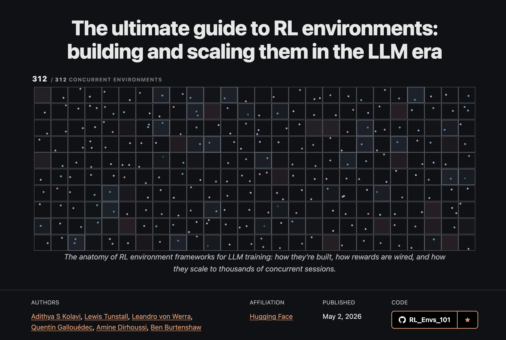

# RL Environments 101: A Guide to Building RL Environments

---

[](https://huggingface.co/spaces/AdithyaSK/rl-environments-guide)

> 📝 **This repo is the companion code to the blog post:** **[RL Environments Guide →](https://huggingface.co/spaces/AdithyaSK/rl-environments-guide)**
> Read the blog for the full write-up. This repo contains the runnable implementations referenced throughout.

---

A practical, hands-on guide to building RL environments for LLMs.

The idea is simple. Take the **same environment** and reimplement it across **multiple RL environment frameworks** (currently OpenEnv, ORS, NeMo Gym, Verifiers, SkyRL Gym, and GEM) so you can see, side by side, how each one models tools, state, rewards, and episodes. The goal isn't training. It's helping you understand the ecosystem: what each framework actually gives you, where the boundaries are, and what code you have to write yourself.

We start with three reference environments — a **Jupyter agent** (multi-turn, real code execution in an E2B sandbox), a **Wordle solver** (multi-turn, pure Python), and a **Desktop computer-use** env (multi-turn, vision-driven, full Linux desktop in an E2B sandbox) — and will keep adding more over time. Each new environment is another "Rosetta stone" entry: same logic, different framework dialects.

If you've ever wondered:
- What is an "RL environment" really made of?
- Why do six frameworks call the same thing by six different names?
- Should I build my env as an HTTP server, or run it in-process?
- How do I plug any of these into TRL's `GRPOTrainer`?

…this repo is the answer. Each framework folder is a **runnable, minimal example** showing how to set up the environment and do a sample LLM rollout against it. We also walk through **how to think about designing an environment** in the first place: the components, the key decisions, and the common pitfalls, independent of any framework.

## Train a model in one command (Tutorials)

The [`tutorials/`](tutorials/) folder is the *hands-on* half — actually **training** an LLM against an
environment with GRPO. No GPU, no cluster, no local setup.

**1. Install the `hf` CLI and log in** (once) with a free [HF token](https://huggingface.co/settings/tokens):

```bash
curl -LsSf https://hf.co/cli/install.sh | bash    # or: pip install -U huggingface_hub
hf auth login                                      # paste your token
```
<sub>Windows: `powershell -ExecutionPolicy ByPass -c "irm https://hf.co/cli/install.ps1 | iex"`</sub>

**2. Launch** — **one line** spins up a GPU with the notebooks loaded and prints a JupyterLab URL (just the `hf` CLI — no Python, no cloning):

```bash
curl -sSL https://raw.githubusercontent.com/adithya-s-k/RL_Envs_101/main/launcher/launch.sh | bash
```
<sub>Windows (PowerShell): `irm https://raw.githubusercontent.com/adithya-s-k/RL_Envs_101/main/launcher/launch.ps1 | iex` · default GPU is an A100, set `FLAVOR=t4-small` for cheaper.</sub>

<sub>Have Python? Same thing via the SDK: `curl -sSL https://raw.githubusercontent.com/adithya-s-k/RL_Envs_101/main/launcher/launch.py | python3 -` (PowerShell: `… | python -`).</sub>

Inside: **`01_latex_ocr_grpo`** (teach Qwen3-VL-2B to read math → LaTeX, reward from an OpenEnv server)
and **`02_lipogram_grpo`** (teach a model to avoid the letter “e” — a reward-design + reward-hacking
lesson). See [`tutorials/README.md`](tutorials/README.md).

## Agent Skills

This repo also ships **5 agent skills** at `.claude/skills/` that turn a plain-English env description into runnable code across the 4 target frameworks. They follow the open [SKILL.md spec](https://github.com/anthropics/skills) and work with any agent that supports it — **Claude Code, Cursor, Codex, OpenCode, Gemini CLI**, and dozens more.

```bash
# install into your current project (auto-detects which agent you use)
npx skills add adithya-s-k/RL_Envs_101
```

Skills included:
- **`rl-env-from-description`** — orchestrator. Just describe the env in plain English; it interviews you, picks an archetype, builds the shared domain module, and ports across all 4 frameworks.
- **`generate-openenv-env`**, **`generate-ors-env`**, **`generate-verifiers-env`**, **`generate-nemo-gym-env`** — single-framework variant builders. Useful when you only want one.

The skills are **folder-agnostic** — they work in any project, don't assume the `envs/<env>/` layout this repo uses, and ask where you want files written. See [Agent Skills](#agent-skills-detail) below for trigger phrases and design notes.

## Table of Contents

- [Train a model in one command (Tutorials)](#train-a-model-in-one-command-tutorials)
- [Repository Layout](#repository-layout)
- [The Reference Environments](#the-reference-environments)
- [Framework Cheat Sheet](#framework-cheat-sheet)
- [How to Set Up the Jupyter Agent Environment](#how-to-set-up-the-jupyter-agent-environment)
- [How to Set Up the Wordle Environment](#how-to-set-up-the-wordle-environment)
- [How to Set Up the Desktop Environment](#how-to-set-up-the-desktop-environment)
- [How to Build an RL Environment](#how-to-build-an-rl-environment) (framework-agnostic)
- [Agent Skills](#agent-skills-detail)
- [Further Reading](#further-reading)
- [Contributing](#contributing)

---

## Repository Layout

```
RL_Envs_101/
├── README.md                       # this file
├── assets/                         # blog thumbnail, diagrams
├── launcher/                       # one-command HF Jobs JupyterLab launchers (launch.sh / .ps1 / .py)
├── tutorials/                      # GRPO notebooks the launcher opens (LaTeX-OCR, lipogram)
└── envs/
    ├── jupyter_env/                # E2B-sandboxed Jupyter agent (multi-turn, 4 tools)
    │   ├── openenv/                # HTTP, MCP protocol
    │   ├── ors/                    # HTTP, REST + SSE
    │   ├── nemo_gym/               # HTTP, REST + cookies
    │   ├── verifiers/              # in-process (Python)
    │   ├── skyrl_gym/              # in-process (Gym-style)
    │   └── gem/                    # in-process (Gymnasium)
    ├── wordle_env/                 # Wordle solver (multi-turn, 1 tool)
    │   ├── openenv/
    │   ├── ors/
    │   ├── nemo_gym/
    │   ├── verifiers/
    │   ├── skyrl_gym/
    │   └── gem/
    └── desktop_env/                # Computer-use desktop (multi-turn, 19 tools, vision)
        ├── desktop.py              # shared DesktopController (E2B + 19 actions)
        ├── tasks.py                # shared task list
        ├── openenv/                # MCP + Gradio UI, image-block screenshots
        ├── ors/                    # ORS protocol, terminate-as-reward
        ├── nemo_gym/               # HTTP, REST + cookies, /verify
        ├── verifiers/              # in-process, plain Python (DesktopToolkit)
        ├── skyrl_gym/              # in-process, BaseTextEnv with action tags
        └── gem/                    # in-process, Gymnasium 5-tuple with action tags
```

---

## The Reference Environments

### Jupyter Agent (multi-turn, tool-using)
- **What the model does:** writes and executes Python in a real Jupyter kernel running inside an E2B cloud sandbox, until it answers the question.
- **Tools (4):** `add_and_execute_code_cell`, `edit_and_execute_current_cell`, `execute_shell_command`, `get_notebook_state`.
- **Why it's interesting:** real code execution, persistent state across turns, a real external backend (E2B).

### Wordle (multi-turn, deterministic)
- **What the model does:** plays Wordle over multiple turns. It guesses a 5-letter word, sees per-letter feedback, refines, and repeats until it solves the puzzle or runs out of attempts.
- **Tools (1):** `guess(word)`.
- **Why it's interesting:** pure-Python logic, no external services, persistent state across turns. The cleanest way to see how each framework models multi-turn episodes without the noise of a sandbox backend.

Wordle is also the *cross-domain proof*: same training and rollout patterns work on a totally different problem with no changes.

### Desktop Computer-Use (multi-turn, vision-driven)
- **What the model does:** sees a screenshot of a full Linux desktop and drives the mouse/keyboard with tool calls until the task is done.
- **Tools (19):** mirror Anthropic's `computer_20251124` schema — `screenshot`, `left/right/middle/double/triple_click`, `mouse_move`, `left_click_drag`, `left_mouse_down/up`, `scroll`, `type`, `key`, `hold_key`, `wait`, `terminate`, `run_command`, `cursor_position`, `get_screen_size`. Coordinates are `[x, y]` pixel arrays so OpenAI Operator and Qwen3-VL output drives the env with minimal token-level adaptation.
- **Why it's interesting:** real cloud VM (E2B Desktop), screenshots returned as **MCP image blocks** (the model sees pixels, not base64 text), terminal reward via `terminate(status)`. Goes well beyond text-only envs.

---

## Framework Cheat Sheet

| Framework  | Type             | Tool syntax            | Reward model     | Deployable | Best for |
|------------|------------------|------------------------|------------------|------------|----------|
| **OpenEnv**    | HTTP (MCP)       | `@mcp.tool`            | External         | ✅ Docker / HF Space | Long-running sandboxes; MCP ecosystem |
| **ORS**        | HTTP (REST+SSE)  | `@tool` + Pydantic     | Per-tool-call    | ✅ Docker / HF Space / OpenReward | Server-decided rewards; OpenReward marketplace |
| **NeMo Gym**   | HTTP (REST)      | `app.post()`           | Post-episode `/verify` | ✅ Docker / HF Space | NVIDIA stack; Ray-based scaling |
| **Verifiers**  | in-process       | plain Python `def`     | `Rubric` system  | ⚙️          | Fast prototyping; bundled datasets |
| **SkyRL Gym**  | in-process       | inside `step()`        | `step()` returns | ⚙️          | Gym-style RL; SkyRL training stack |
| **GEM**        | in-process       | inside `step()`        | `step()` returns | ⚙️          | Gymnasium API; pure-Python games |

HTTP frameworks (OpenEnv, ORS, NeMo Gym) wrap a remote server. In-process frameworks (Verifiers, SkyRL, GEM) run the env class in the same Python process as the trainer or rollout script.

---

## How to Set Up the Jupyter Agent Environment

Every framework folder under `envs/jupyter_env/<framework>/` ships a working `rollout.py`. Each rollout connects to the env (deployed HF Space or local server, depending on framework), wires up the env's tools, and drives a multi-turn loop with **Qwen3-Coder-480B** through Hugging Face Inference Providers using the standard `openai` Python client. Auto-detect: if `ROLLOUT_MODEL` contains a `:provider` suffix it's routed via the HF Router, otherwise it goes to OpenAI native.

### Credentials (one-time setup)

```bash
cp .env.example .env       # at the repo root
# fill in:
#   HF_TOKEN=hf_...        for HF Inference Providers (Qwen)
#   OPENAI_API_KEY=sk-...  optional, only if ROLLOUT_MODEL is an OpenAI model
#   E2B_API_KEY=e2b_...    required for in-process envs and for running HTTP servers locally
```

Every `rollout.py` reads these via `python-dotenv` from the **repo-root `.env`** — you don't need a `.env` per folder.

<details>
<summary><b>1. OpenEnv</b> &nbsp;·&nbsp; HTTP / MCP &nbsp;·&nbsp; <code>MCPToolClient</code> &nbsp;·&nbsp; deployed + local both verified</summary>

```bash
cd envs/jupyter_env/openenv
uv sync
uv run python rollout.py                 # talks to deployed HF Space by default
# or run the env locally first:
uv run python -m server.app              # serves on :8000
OPENENV_URL=http://localhost:8000 uv run python rollout.py
```
The rollout uses `openenv-core`'s generic `MCPToolClient` — no env-specific package install required. Tools are auto-discovered via `list_tools()` and converted to OpenAI tool schemas. Deployed: [`AdithyaSK/jupyter-agent-openenv`](https://huggingface.co/spaces/AdithyaSK/jupyter-agent-openenv). Verified end-to-end with both Qwen and `gpt-4o-mini`.

</details>

<details>
<summary><b>2. ORS</b> &nbsp;·&nbsp; HTTP / REST + SSE &nbsp;·&nbsp; <code>openreward</code> &nbsp;·&nbsp; per-call reward &nbsp;·&nbsp; deployed + local both verified</summary>

```bash
cd envs/jupyter_env/ors
uv sync
uv run python rollout.py                 # talks to deployed HF Space
# or local:
uv run python server.py                  # serves on :8080
ORS_URL=http://localhost:8080 uv run python rollout.py
```
Uses the official [`openreward`](https://pypi.org/project/openreward/) client: `EnvironmentsAPI(base_url=..., api_key="").get("jupyteragentors").session(task=tasks[0])`. Reward arrives **per tool call** as `ToolOutput.reward`. Deployed: [`AdithyaSK/jupyter-agent-ors`](https://huggingface.co/spaces/AdithyaSK/jupyter-agent-ors). Verified end-to-end (`reward=1.18 finished=True`).

</details>

<details>
<summary><b>3. NeMo Gym</b> &nbsp;·&nbsp; HTTP / REST + cookies &nbsp;·&nbsp; raw <code>requests</code> &nbsp;·&nbsp; deployed only (Ray blocks local)</summary>

```bash
cd envs/jupyter_env/nemo_gym
uv sync                                  # needs Python 3.12
uv run python rollout.py                 # talks to deployed HF Space
```
Raw HTTP via `requests` + cookies, no SDK needed. `POST /seed_session` sets the session cookie, then `POST /<tool_name>` for each call. Deployed: [`AdithyaSK/jupyter-agent-nemo-gym`](https://huggingface.co/spaces/AdithyaSK/jupyter-agent-nemo-gym).

> ⚠️ NeMo Gym **requires Ray** at server startup, which fails on shared HF / SLURM cluster nodes (`gcs_server` can't bind). Local `python server.py` does not work on those machines, so the deployed Space is the path. See `envs/jupyter_env/nemo_gym/README.md` for the full story.

</details>

<details>
<summary><b>4. Verifiers</b> &nbsp;·&nbsp; in-process / plain Python &nbsp;·&nbsp; auto-built OpenAI tool schemas via <code>inspect</code></summary>

```bash
cd envs/jupyter_env/verifiers
uv sync
uv run python rollout.py
```
No server. The 4 tool functions are imported directly from `env.py`; OpenAI tool schemas are auto-generated from each function's signature + docstring via `inspect`. The E2B sandbox is created in-process, so `E2B_API_KEY` is required.

</details>

<details>
<summary><b>5. SkyRL Gym</b> &nbsp;·&nbsp; in-process / <code>BaseTextEnv</code> &nbsp;·&nbsp; text-action with tag parsing</summary>

```bash
cd envs/jupyter_env/skyrl_gym
uv sync
uv run python rollout.py
```
`JupyterSkyRLEnv(BaseTextEnv)` with `init()` / `step()`. **No OpenAI tool-calling** — the rollout passes the raw assistant text as the action; the env parses `<code>...</code>` / `<shell>...</shell>` / `<edit>...</edit>` tags out of it. `step()` returns `BaseTextEnvStepOutput(observations, reward, done, ...)`.

</details>

<details>
<summary><b>6. GEM</b> &nbsp;·&nbsp; in-process / <code>gem.Env</code> &nbsp;·&nbsp; Gymnasium 5-tuple</summary>

```bash
cd envs/jupyter_env/gem
uv sync
uv run python rollout.py
```
`JupyterGemEnv(gem.Env)` with `reset()` / `step()`. Same text-action + tag-parsing pattern as SkyRL, but `step()` returns the classic Gymnasium 5-tuple `(obs, reward, terminated, truncated, info)`. Has `spawn()` for parallel rollouts.

</details>

### Common rollout knobs

| Variable | Default | Where it goes |
|---|---|---|
| `ROLLOUT_MODEL` | `Qwen/Qwen3-Coder-480B-A35B-Instruct:together` | If it contains `:` → HF Router. Else → OpenAI native. |
| `MAX_TURNS` | `6`–`8` | Hard cap on tool-call / step turns per rollout. |
| `OPENENV_URL` / `ORS_URL` / `NEMO_GYM_URL` | deployed HF Space | Set to `http://localhost:<port>` to hit a local server. |

### Local-server status (verified)

| Framework | Deployed Space | Local server |
|---|---|---|
| openenv | ✅ | ✅ `uv run python -m server.app` (:8000) |
| ors | ✅ | ✅ `uv run python server.py` (:8080) |
| nemo_gym | ✅ | ⚙️ Ray init fails on shared cluster nodes |
| verifiers / skyrl_gym / gem | n/a (in-process) | n/a (in-process) |

> Each framework subfolder has its own `README.md` with the canonical consumption pattern, configuration knobs, and full sample rollout output.

---

## How to Set Up the Wordle Environment

Wordle has **no external backend** — it's pure Python (the shared `WordleGame` lives in `envs/wordle_env/game.py`). The same `guess(word)` tool, the same dictionary, the same scoring, written six different ways. Each framework folder ships a working `rollout.py` and `README.md` following the exact same pattern as the Jupyter agent rollouts.

<details>
<summary><b>1. OpenEnv</b> &nbsp;·&nbsp; HTTP / MCP &nbsp;·&nbsp; 3 tools: <code>guess</code>, <code>get_history</code>, <code>reset_game</code></summary>

```bash
cd envs/wordle_env/openenv && uv sync && uv run python rollout.py
```
Generic `MCPToolClient` against [`AdithyaSK/wordle-openenv`](https://huggingface.co/spaces/AdithyaSK/wordle-openenv).

</details>

<details>
<summary><b>2. ORS</b> &nbsp;·&nbsp; HTTP / REST + SSE &nbsp;·&nbsp; 50 bundled tasks in the <code>train</code> split</summary>

```bash
cd envs/wordle_env/ors && uv sync && uv run python rollout.py
```
[`openreward`](https://pypi.org/project/openreward/) client → `EnvironmentsAPI(base_url=..., api_key="").get("wordleors")` against [`AdithyaSK/wordle-ors`](https://huggingface.co/spaces/AdithyaSK/wordle-ors). Each task has the answer in `task_spec`.

</details>

<details>
<summary><b>3. NeMo Gym</b> &nbsp;·&nbsp; HTTP / REST + cookies &nbsp;·&nbsp; raw <code>requests</code></summary>

```bash
cd envs/wordle_env/nemo_gym && uv sync && uv run python rollout.py
```
Raw `requests` against [`AdithyaSK/wordle-nemo-gym`](https://huggingface.co/spaces/AdithyaSK/wordle-nemo-gym). Same Ray-blocks-local caveat as the Jupyter sibling — deployed Space is the path.

</details>

<details>
<summary><b>4. Verifiers</b> &nbsp;·&nbsp; in-process / <code>WordleToolkit</code></summary>

```bash
cd envs/wordle_env/verifiers && uv sync && uv run python rollout.py
```
Imports `WordleToolkit`, auto-builds OpenAI tool schemas via `inspect`, drives the loop manually.

</details>

<details>
<summary><b>5. SkyRL Gym</b> &nbsp;·&nbsp; in-process / <code>BaseTextEnv</code> &nbsp;·&nbsp; <code>&lt;guess&gt;word&lt;/guess&gt;</code> tag parsing</summary>

```bash
cd envs/wordle_env/skyrl_gym && uv sync && uv run python rollout.py
```
`WordleSkyRLEnv(BaseTextEnv)` with text-action: model emits `<guess>word</guess>`, env parses.

</details>

<details>
<summary><b>6. GEM</b> &nbsp;·&nbsp; in-process / <code>gem.Env</code> &nbsp;·&nbsp; Gymnasium 5-tuple</summary>

```bash
cd envs/wordle_env/gem && uv sync && uv run python rollout.py
```
`WordleGemEnv(gem.Env)` returns `(obs, reward, terminated, truncated, info)`.

</details>

> Compare any two `server.py` (or env class) files side-by-side and you'll learn more about the frameworks in 10 minutes than from any docs page.

The HTTP variants are deployed on HF Spaces (cold-start may take a minute):

- OpenEnv: [`AdithyaSK/wordle-openenv`](https://huggingface.co/spaces/AdithyaSK/wordle-openenv)
- ORS: [`AdithyaSK/wordle-ors`](https://huggingface.co/spaces/AdithyaSK/wordle-ors)
- NeMo Gym: [`AdithyaSK/wordle-nemo-gym`](https://huggingface.co/spaces/AdithyaSK/wordle-nemo-gym)

The shared `WordleGame` logic lives at `envs/wordle_env/game.py` and is reused by all six framework folders.

---

## How to Set Up the Desktop Environment

The Desktop env is the third reference: a full Linux desktop in a cloud sandbox, controlled by the model with vision + computer-use tools. **Six framework variants**, all sharing the same 19-tool action schema modelled on Anthropic's `computer_20251124` (the broadest superset across Claude / OpenAI Operator / Qwen3-VL ComputerUse) so a model's native computer-use output drives the env with minimal token-level adaptation.

The shared `DesktopController` in `envs/desktop_env/desktop.py` wraps E2B Desktop with all 19 actions (`screenshot`, `left/right/middle/double/triple_click`, `mouse_move`, `left_click_drag`, `left_mouse_down/up`, `scroll`, `type`, `key`, `hold_key`, `wait`, `terminate`, `run_command`, `cursor_position`, `get_screen_size`). Coordinates are `[x, y]` arrays in pixel space.

The HTTP variants ship **two rollouts**: OpenAI `computer-use-preview` (Responses API) and Qwen3-VL via HF Router. The in-process variants ship one Qwen3-VL rollout (multimodal per turn).

<details>
<summary><b>1. OpenEnv</b> &nbsp;·&nbsp; HTTP / MCP &nbsp;·&nbsp; Gradio UI &nbsp;·&nbsp; <code>ImageContent</code> screenshots &nbsp;·&nbsp; deployed + local</summary>

```bash
cd envs/desktop_env/openenv
uv sync
uv run uvicorn server.app:app --port 8000 &
uv run python rollout_openai.py                  # OpenAI computer-use-preview
uv run python rollout_qwen.py                    # Qwen3-VL via HF Router
```
Generic `MCPToolClient` against [`AdithyaSK/desktop-openenv`](https://huggingface.co/spaces/AdithyaSK/desktop-openenv). Custom Gradio UI mounted at `/web` reuses the original `e2b_desktop` reference UI. Screenshots come back as MCP image blocks so the model actually sees pixels.

</details>

<details>
<summary><b>2. ORS</b> &nbsp;·&nbsp; HTTP / REST + SSE &nbsp;·&nbsp; <code>openreward</code> &nbsp;·&nbsp; per-call reward + <code>terminate</code> signal</summary>

```bash
cd envs/desktop_env/ors && uv sync
uv run python server.py --port 8080 &
uv run python rollout_openai.py
uv run python rollout_qwen.py
```
[`openreward`](https://pypi.org/project/openreward/) client → `EnvironmentsAPI(base_url=..., api_key="").get("desktopors")` against [`AdithyaSK/desktop-ors`](https://huggingface.co/spaces/AdithyaSK/desktop-ors). `terminate(status="success")` → `reward=1.0, finished=True`.

</details>

<details>
<summary><b>3. NeMo Gym</b> &nbsp;·&nbsp; HTTP / REST + cookies &nbsp;·&nbsp; raw <code>requests</code> &nbsp;·&nbsp; <code>/verify</code> grader</summary>

```bash
cd envs/desktop_env/nemo_gym && uv sync && uv run python server.py
uv run python rollout.py
```
19 tools as `app.post("/<tool>")` endpoints + `/seed_session` + `/verify`. Same Ray-blocks-local caveat as the Jupyter sibling — deployed Space is the path on shared cluster nodes.

</details>

<details>
<summary><b>4. Verifiers</b> &nbsp;·&nbsp; in-process / plain Python &nbsp;·&nbsp; <code>DesktopToolkit</code></summary>

```bash
cd envs/desktop_env/verifiers && uv sync && uv run python rollout.py
```
`DesktopToolkit` owns one E2B sandbox per episode; public methods are introspected as tools by both the TRL adapter and `vf.ToolEnv`. `screenshot()` returns the image as base64 PNG embedded in markdown.

</details>

<details>
<summary><b>5. SkyRL Gym</b> &nbsp;·&nbsp; in-process / <code>BaseTextEnv</code> &nbsp;·&nbsp; tag-parsed actions</summary>

```bash
cd envs/desktop_env/skyrl_gym && uv sync && uv run python rollout.py
```
`DesktopSkyRLEnv(BaseTextEnv)` parses action tags from free text: `<click x="100" y="200"/>`, `<type>hello</type>`, `<key>ctrl+s</key>`, `<terminate status="success"/>`, etc. The rollout sends the latest screenshot as an image in the user message each turn so a multimodal model can ground its coordinates.

</details>

<details>
<summary><b>6. GEM</b> &nbsp;·&nbsp; in-process / <code>gem.Env</code> &nbsp;·&nbsp; Gymnasium 5-tuple, same tag grammar</summary>

```bash
cd envs/desktop_env/gem && uv sync && uv run python rollout.py
```
`DesktopGemEnv(gem.Env)` returns `(obs, reward, terminated, truncated, info)`. Same tag grammar as SkyRL — only the framework wrapping differs.

</details>

The HTTP variants are deployed on HF Spaces (cold-start may take a minute):

- OpenEnv: [`AdithyaSK/desktop-openenv`](https://huggingface.co/spaces/AdithyaSK/desktop-openenv)
- ORS: [`AdithyaSK/desktop-ors`](https://huggingface.co/spaces/AdithyaSK/desktop-ors)

Both Spaces expect `E2B_API_KEY` set as a Space secret. The in-process variants need `E2B_API_KEY` in your repo-root `.env`.

### Local-rollout status (verified)

| Framework | Result |
|---|---|
| openenv | ✅ end-to-end vs deployed Space (OpenAI computer-use-preview + Qwen3-VL) |
| ors     | ✅ end-to-end vs deployed Space (both models) |
| nemo_gym | ⚙️ Ray init fails on shared cluster nodes (same as wordle/jupyter siblings) |
| verifiers | ✅ in-process rollout via `DesktopToolkit` (Qwen3-VL) |
| skyrl_gym | ✅ in-process rollout — tag-parsed actions reach E2B (Qwen3-VL) |
| gem       | ✅ in-process rollout — `reward=1.0` on first turn (Qwen3-VL emitted `<click>`+`<type>`+`<key>`+`<terminate>` inline) |

> Note on coordinate spaces: Qwen3-VL emits coordinates outside the configured display (e.g. y≈965 in a 768-px screen), suggesting an internal normalized scale. A small rescaling adapter in the rollout will be needed before training.

---

## How to Build an RL Environment

Framework-agnostic. This section is about **how to think** before you start writing code.

### Step 1. Define the loop in plain English

Before opening any framework's docs, write down:

1. **What is the model trying to do?** ("Solve coding tasks", "Play Wordle", "Browse the web until it finds X").
2. **What can it DO?** List the actions and tools.
3. **What does it SEE back?** The observation format.
4. **When is it done?** Termination condition.
5. **How do you score it?** The reward function, even a sketch.

If you can't write this in 10 lines, you don't have an environment yet. You have an idea.

### Step 2. Identify the components

Every RL environment, regardless of framework, is made of these eight pieces:

| Component | What it answers | Decide before coding |
|-----------|----------------|----------------------|
| **Tasks / Dataset** | *What problems should the model solve?* | List 5 to 10 example tasks by hand. |
| **Prompt template** | *How is the task presented?* | Write the system + user prompt. |
| **Tools / Actions** | *What can the model DO?* | Sketch function signatures. |
| **Observations** | *What does the model SEE back?* | Decide: raw string? structured? |
| **Execution backend** | *Where do actions actually run?* | Sandbox? In-process Python? None? |
| **State** | *What persists across turns?* | Session-scoped dict? File system? |
| **Reward / Rubric** | *How is success measured?* | Exact match? LLM-as-judge? Unit tests? |
| **Termination** | *When does it end?* | Max turns? `done` from a tool? |

Picking a framework before you've written these down is putting the cart before the horse.

### Step 3. Make four key decisions

These four decisions, more than any framework feature, determine what your environment will look like.

#### Decision A. In-process or HTTP server?

| Factor | Pick **in-process** if… | Pick **HTTP server** if… |
|---|---|---|
| Backend | Pure Python (game logic, math) | Sandbox / Docker / external service |
| Scale | <100 parallel rollouts | 100s to 1000s of concurrent sessions |
| Iteration speed | You're prototyping | Production deployment |
| Resource isolation | Doesn't matter | Env shouldn't share GPU node deps |
| Languages | Python only | Mixed (env can be in any language) |

**Rule of thumb:** start in-process. Move to HTTP only when you outgrow it.

#### Decision B. Single-turn or multi-turn?

- **Single-turn:** the model produces one output, you score it, done. (A math problem, classification, single-shot guess.) Reward is a function over the final answer.
- **Multi-turn:** the model takes multiple actions, sees results, decides what to do next. (Coding agent, Wordle, web browser, dialog.) State must persist, and you must decide *who* controls the loop (trainer, framework, or env).

Multi-turn is **far** more complex. If you can frame your task as single-turn, do it.

#### Decision C. Where does the reward come from?

| Pattern | When to use | Example framework |
|---|---|---|
| **External** (training script computes from final output) | Reward depends on the trajectory as a whole | OpenEnv, Verifiers, SkyRL, GEM |
| **Per tool call** (env returns reward with each action) | You can score every step independently | ORS |
| **Post-episode `/verify`** (separate endpoint scores the run) | Holistic LLM-as-judge or unit-test scoring | NeMo Gym |

If you're unsure, **start with external**. It's the most flexible and the easiest to debug.

#### Decision D. Stateless or stateful tools?

- **Stateless tools** (`add(a,b)` returning `a+b`) are trivial: no session needed.
- **Stateful tools** (`run_code(...)` in a Jupyter kernel) need session management. Every concurrent rollout needs its own isolated state. This is where session IDs, cookies, and sandbox lifetimes start to matter.

If your tools are stateful, you'll spend half your engineering time on state management. Plan for it.

### Step 4. Pick the framework that matches your decisions

| If you decided… | Strong match |
|---|---|
| In-process + bundled dataset + rubric system | **Verifiers** |
| In-process + Gymnasium API + parallel `make_vec()` | **GEM** |
| In-process + Gym-style + SkyRL trainer | **SkyRL Gym** |
| HTTP + MCP / community + HF Spaces | **OpenEnv** |
| HTTP + per-call rewards + OpenReward marketplace | **ORS** |
| HTTP + post-episode verify + NVIDIA stack | **NeMo Gym** |

When in doubt: **prototype in Verifiers (fastest), productionize in OpenEnv or ORS (deployable).**

### Step 5. Implement the smallest possible version first

Don't try to build the final environment on day one. Build the dumbest possible version:

1. **One task.** Hardcoded.
2. **One tool.** Even if your real env has ten.
3. **No reward.** Just print "got result: X".
4. **One rollout.** With a known model, e.g. `Qwen3-4B`, no training.

Get that working end-to-end. Only then add: more tasks, more tools, real rewards, batching, async, deployment.

### Step 6. Validate with a rollout, not with training

Training is a slow, expensive way to find out your environment is broken. Before you run *any* training:

- Manually call `env.reset()`, then call each tool, then `env.close()`.
- Run a single LLM rollout and **read the trajectory by hand**. Did the model see what you expected? Did the tool returns make sense? Did the reward fire correctly?
- If a human can't read the trajectory and tell whether the model did well, neither can a reward function.

The biggest mistakes in RL env design are caught by reading 5 trajectories. They will *not* be caught by 1000 training steps.

### Common pitfalls

- **Reward is too sparse.** Every rollout returns 0.0, so GRPO has no signal. Fix: design partial credit, or pick easier tasks for the smoke test.
- **Reward is too dense or leaky.** Model gets reward for behaviors that don't generalize. Fix: read trajectories, look for shortcuts.
- **Tasks are too easy.** Model solves them in one tool call, so there's no learning signal in multi-turn settings.
- **Tools are too powerful.** One tool can solve everything, so there's no exploration and no interesting behavior.
- **State leaks across rollouts.** Same sandbox or dict reused without reset, so episodes contaminate each other.
- **No timeout or max turns.** A buggy model loops forever and stalls training.
- **Observation format the model can't parse.** Huge JSON dumps, or stack traces longer than the context window.

---

<a id="agent-skills-detail"></a>

## Agent Skills

5 agent skills under `.claude/skills/`, written to the open [SKILL.md spec](https://github.com/anthropics/skills) so any spec-compliant agent (Claude Code, Cursor, Codex, OpenCode, Gemini CLI, …) can load them.

| Skill | What it builds |
|---|---|
| `rl-env-from-description` | Orchestrator — interview, archetype selection, shared domain module, all 4 framework variants, smoke-test rollouts |
| `generate-openenv-env` | OpenEnv (Meta) MCP variant |
| `generate-ors-env` | OpenReward (ORS) per-call-reward variant |
| `generate-verifiers-env` | Verifiers (PrimeIntellect) in-process variant |
| `generate-nemo-gym-env` | NeMo Gym (NVIDIA) Resources Server variant |

### Install

```bash
# auto-detects your agent (Claude Code, Cursor, Codex, etc.) and installs into the right place
npx skills add adithya-s-k/RL_Envs_101
```

If you've cloned this repo, the skills are already loaded — every spec-compliant agent auto-discovers `.claude/skills/` when launched in the repo (verify with `ls .claude/skills/`).

### Use

Triggering is automatic from the descriptions. Examples:

| What you type | Triggers |
|---|---|
| *"make me an env where the agent plays connect-four"* | `rl-env-from-description` (orchestrator) |
| *"wrap my game in OpenEnv"* | `generate-openenv-env` |
| *"add per-call rewards via OpenReward"* | `generate-ors-env` |
| *"build a Verifiers toolkit for X"* | `generate-verifiers-env` |
| *"make a NeMo Gym resources server"* | `generate-nemo-gym-env` |

The skills are **folder-agnostic** — they work in any project, don't assume the `envs/<env>/` layout this repo uses, and ask where you want files written.

---

## Further Reading

📝 **Blog post:** [RL Environments Guide](https://huggingface.co/spaces/AdithyaSK/rl-environments-guide), the full write-up this repo accompanies.

### Framework links

- [OpenEnv](https://github.com/meta-pytorch/OpenEnv) (Meta)
- [ORS / OpenReward](https://openrewardstandard.io/) (General Reasoning)
- [NeMo Gym](https://github.com/NVIDIA-NeMo/Gym) (NVIDIA)
- [Verifiers](https://github.com/PrimeIntellect-ai/verifiers) (PrimeIntellect)
- [SkyRL Gym](https://github.com/NovaSky-AI/SkyRL/tree/main/skyrl-gym) (NovaSky-AI)
- [GEM](https://github.com/axon-rl/gem) (Axon-RL)

---

## Contributing

🚧 **More environments and framework implementations are on the way. PRs welcome!**

Good ways to contribute:
- **Port an existing env to a new framework** (e.g. add a 7th implementation).
- **Add a new reference environment.** Pick something with a clear loop and reward, and ship it across as many frameworks as you can.
- **Improve the rollout or setup scripts.** Make them clearer, faster, more portable.
- **Fix bugs or docs.** Typos, broken commands, outdated links.

Open an issue first if you're planning anything larger than a small fix.
