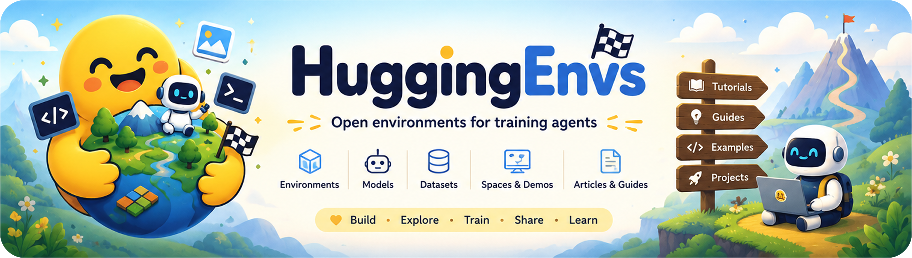
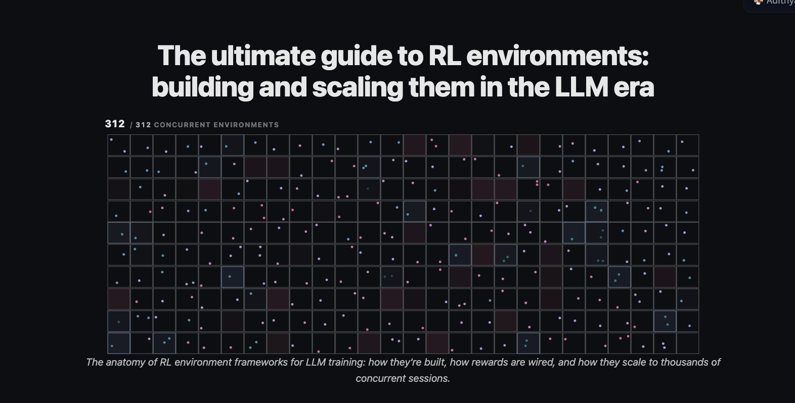
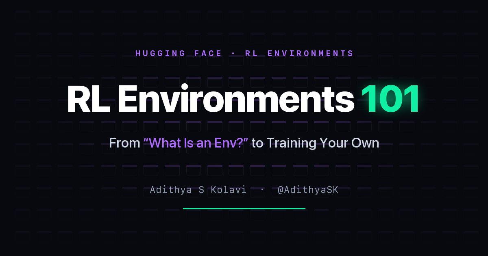
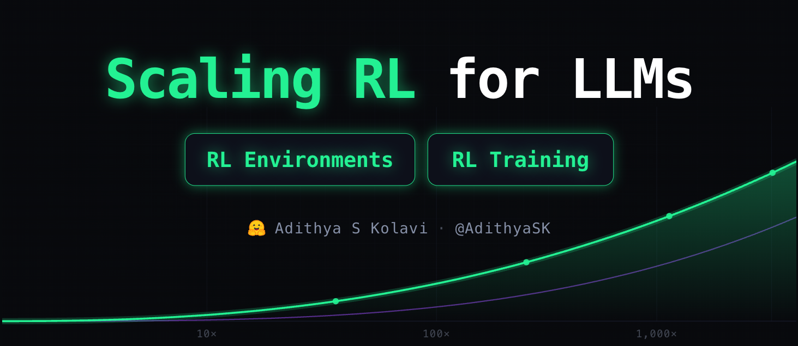
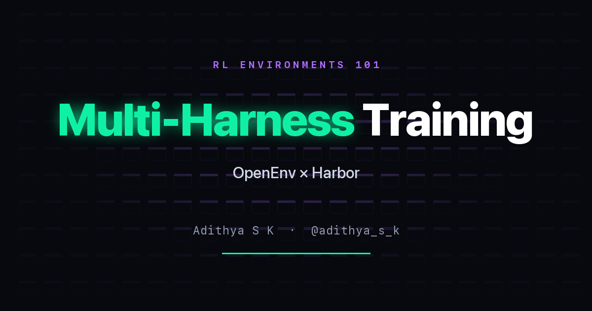

<div align="center">



<h1>HuggingEnvs</h1>

<h3>Open source RL environments for LLM agents</h3>

<p><b>Build&nbsp; ·&nbsp; Deploy&nbsp; ·&nbsp; Train&nbsp; ·&nbsp; Eval&nbsp; — end to end, reproducible, in the open.</b></p>

<a href="https://huggingface.co/HuggingEnvs"></a>
<a href="https://huggingface.co/spaces/AdithyaSK/rl-environments-guide"></a>
<a href="https://github.com/adithya-s-k/HuggingEnvs/stargazers"></a>
<a href="./LICENSE"></a>

</div>

---

## Why this exists

The RL environment ecosystem is moving *fast*. New frameworks land every few weeks, each with its own
vocabulary for the same handful of ideas, and most of what's written about them is either a launch post
or a spec. Meanwhile the actual bottleneck in RL for LLMs has quietly shifted: the algorithm isn't the
hard part any more — **the environment is.**

So we're building the resource we wanted. Open source, end to end, and reproducible: how to *design* an
environment, how to *build* it, how to *deploy* it, how to *train* against it, and how to *scale* it to
thousands of concurrent sessions. Real code you can run, not diagrams of code someone else ran.

Every environment here works. Every rollout has been executed. Every training curve came from a job you
can launch yourself, in one command, without a GPU of your own.

<div align="center">

**3** environments&nbsp; · &nbsp;**6** frameworks&nbsp; · &nbsp;**18** implementations&nbsp; · &nbsp;**8** deployed Spaces&nbsp; · &nbsp;**5** agent skills

</div>

**Where things live:** source, recipes and notebooks in this repo · environments, datasets, models and
demos on **[🤗 huggingface.co/HuggingEnvs](https://huggingface.co/HuggingEnvs)**.

---

## Projects

Each numbered folder is a **self-contained, end-to-end project** — its own environments, notebooks,
results and README, plus the Hub repos it owns. They read in order but stand alone.

### [00 · RL Environments 101](./00-environments-101/) &nbsp;<sub>3 environments · 6 frameworks · 8 live Spaces</sub>

**One env, six ways.** Three environments, each implemented six times — same logic, six framework
dialects. Diff any two `server.py` files and the differences *are* the lesson.

| Environment | Turns | Tools | Backend |
|---|---|---|---|
| [**Jupyter agent**](./00-environments-101/envs/jupyter/) | multi | 4 | E2B sandbox, real code execution |
| [**Wordle**](./00-environments-101/envs/wordle/) | multi | 1 | pure Python, no backend |
| [**Desktop**](./00-environments-101/envs/desktop/) | multi | 19 | E2B Desktop, vision-driven |

Across `openenv` · `ors` · `nemo_gym` · `verifiers` · `skyrl_gym` · `gem` — 18 implementations, 8 of
them deployed as Spaces you can hit right now.

### [01 · LaTeX OCR](./01-latex-ocr/) &nbsp;<sub>train a VLM against a served reward</sub>

**The full loop.** Project 00 shows you what an environment *is*; this one takes a single environment
all the way to a trained model.

Qwen3-VL-2B learns to read rendered math into LaTeX with GRPO, scored by a reward served from a live
[OpenEnv Space](https://huggingface.co/spaces/AdithyaSK/latex-ocr-env). Correctness is checkable —
render the prediction, compare — so the reward is honest and there is very little to game. Runs on a
GPU you spin up in [one command](#quickstart); no cluster, no local GPU.

> **More coming.** Each new project is another end-to-end recipe: an environment, a training run, and
> the artifacts on the Hub. [Proposals and contributions welcome →](./CONTRIBUTING.md)

---

## Articles &amp; talks

Long-form writing and conference talks. Sources live in [`content/`](./content/); each one ships to the
Hub as a Space.

<table>
<tr>
<td width="33%" valign="top">

<a href="https://huggingface.co/spaces/AdithyaSK/rl-environments-guide"></a>

#### [The Ultimate Guide to RL Environments](https://huggingface.co/spaces/AdithyaSK/rl-environments-guide)

 

Building and scaling RL environments in the LLM era — how frameworks are built, how rewards are
wired, and how they scale to thousands of concurrent sessions.

<sub>📂 [`content/articles/rl-environments-guide/`](./content/articles/rl-environments-guide/)</sub>

</td>
<td width="33%" valign="top">

<a href="https://huggingface.co/spaces/AdithyaSK/rl-environments-101-slides"></a>

#### [RL Environments 101](https://huggingface.co/spaces/AdithyaSK/rl-environments-101-slides)

 

From "what is an env?" to training your own. RL fundamentals → environment anatomy → OpenEnv →
training with TRL. The original 30-minute talk.

<sub>📂 [`content/slides/rl-environments-101/`](./content/slides/rl-environments-101/)</sub>

</td>
<td width="33%" valign="top">

<a href="https://huggingface.co/spaces/AdithyaSK/scaling-rl-for-llms-amd-ai-dev-day"></a>

#### [Scaling RL for LLMs](https://huggingface.co/spaces/AdithyaSK/scaling-rl-for-llms-amd-ai-dev-day)

  

What an environment actually is, how reward hacking happens, and how to build and train against your
own. The 20-minute cut, for AMD AI Dev Day.

<sub>📂 [`content/slides/scaling-rl-amd/`](./content/slides/scaling-rl-amd/)</sub>

</td>
</tr>
<tr>
<td width="33%" valign="top">

<a href="https://huggingface.co/spaces/AdithyaSK/multi-harness-training-slides"></a>

#### [Multi-Harness Training](https://huggingface.co/spaces/AdithyaSK/multi-harness-training-slides)

 

OpenEnv × Harbor — why an environment's failure model decides whether it can be trained against:
in-process agent loops vs. an HTTP boundary, and what it takes to capture trainable tokens.

<sub>📂 [`content/slides/multi-harness-training/`](./content/slides/multi-harness-training/)</sub>

</td>
<td width="33%" valign="top">
</td>
<td width="33%" valign="top">
</td>
</tr>
</table>

---

## Quickstart

**Run an environment.** Wordle is pure Python with no external backend — the fastest full rollout:

```bash
git clone https://github.com/adithya-s-k/HuggingEnvs
cd HuggingEnvs
cp .env.example .env          # HF_TOKEN, plus E2B_API_KEY for sandbox-backed envs

cd 00-environments-101/envs/wordle/verifiers
uv sync && uv run python rollout.py
```

**Train a model against one.** No GPU, no cluster, no setup — one command spins up a GPU with the
notebooks loaded and prints a JupyterLab URL:

```bash
curl -sSL https://raw.githubusercontent.com/adithya-s-k/HuggingEnvs/main/tools/jupyter_launch.py | python3 -
```

<sub>Windows (PowerShell): `irm https://raw.githubusercontent.com/adithya-s-k/HuggingEnvs/main/tools/jupyter_launch.py | python -`. Set `FLAVOR=t4-small` for a cheaper GPU. Track jobs at [huggingface.co/settings/jobs](https://huggingface.co/settings/jobs).</sub>

---

## Build your own environment

Five [SKILL.md](https://github.com/anthropics/skills)-spec agent skills turn a plain-English description
into a runnable RL environment across four frameworks. They work in **any** project — with Claude Code,
Cursor, Codex, OpenCode, Gemini CLI and others.

```bash
npx skills add adithya-s-k/HuggingEnvs
```

| Skill | What it builds |
|---|---|
| **`rl-env-from-description`** | Orchestrator — interviews you, then ports across all four frameworks |
| `generate-openenv-env` | [OpenEnv](https://github.com/meta-pytorch/OpenEnv) (Hugging Face / Meta) — HTTP + MCP |
| `generate-ors-env` | [OpenReward](https://openreward.ai) (ORS) — per-tool-call rewards |
| `generate-verifiers-env` | [Verifiers](https://github.com/PrimeIntellect-ai/verifiers) (Prime Intellect) — in-process + rubrics |
| `generate-nemo-gym-env` | [NeMo Gym](https://github.com/NVIDIA-NeMo/Gym) (NVIDIA) — HTTP + post-episode `/verify` |

> *"make me an env where the agent plays connect-four"* — that's the whole interface.

---

## Repository layout

```
HuggingEnvs/
├── 00-environments-101/     3 environments × 6 frameworks
├── 01-latex-ocr/            train a VLM against a served reward
├── content/
│   ├── articles/            long-form sources (Astro → Docker Space)
│   └── slides/              talk decks (Vite → static Space)
├── tools/                   launcher, Space deploy, index generation
├── assets/                  brand + content thumbnails
└── .claude/skills/          the five environment-authoring agent skills
```

Inside a project the folders always mean the same thing: `envs/` (implementations, shared logic in
`core/`), `train/` (configs + launch), `notebooks/`, `results/`.

---

## Contributing

**We're actively looking for new end-to-end recipes** — a task, an environment, a training run, and
honest results. Domains we don't cover yet are especially welcome: web browsing, SQL, games,
robotics sims, tool-use over real APIs, long-horizon software engineering.

Half-finished counts. A recipe with real numbers and a gap beats a polished one nobody ran — open an
issue and we'll help you land it. New framework ports, reproductions that *disagree* with ours, and
corrections to the guide are all just as welcome.

See **[CONTRIBUTING.md](./CONTRIBUTING.md)**. The fastest path to a new environment is the
`rl-env-from-description` skill.

## Citation

```bibtex
@misc{huggingenvs,
  author = {Kolavi, Adithya S},
  title  = {HuggingEnvs: Open Source RL Environments for LLM Agents},
  year   = {2026},
  url    = {https://github.com/adithya-s-k/HuggingEnvs}
}
```

## License

[Apache 2.0](./LICENSE)

<div align="center">
<sub>Built in the open · <a href="https://huggingface.co/HuggingEnvs">🤗 HuggingEnvs</a> · <a href="https://huggingface.co/AdithyaSK">@AdithyaSK</a></sub>
</div>
