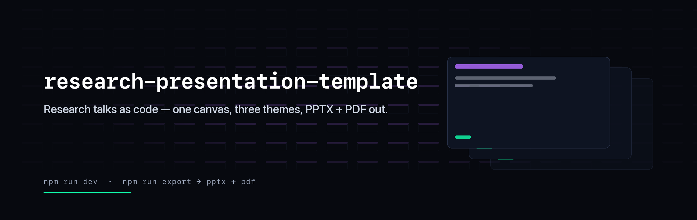

<p align="center">
  
</p>

# research-presentation-template

A template for **research talks**. Slides are React components on a fixed
1280×720 canvas that scales to any projector, so the layout you author is the
layout that shows up in the room. Dark/light, three themes, export to **PPTX and
PDF**, and authoring instructions your AI assistant actually follows.

The presentation-shaped counterpart to
[research-article-template](https://github.com/tfrere/research-article-template).

> **Live example:** [RL Environments 101](https://adithyask-rl-environments-101-slides.static.hf.space)
> — a real 68-slide conference talk, included in this repo as runnable code.

## Quickstart

```bash
npm install
npx playwright install chromium   # once, for PPTX/PDF export
npm run dev                       # http://localhost:5173
```

Then edit `presentation.config.json` — title, authors, venue, links, theme — and
start writing slides in `src/slides/`.

| Key | |
| --- | --- |
| `→` `Space` | next |
| `←` | previous |
| `t` | dark / light |
| `f` | fullscreen |
| `p` | print → PDF |
| `⚙` | slide list, theme, export buttons |

## What you get

- **One config file.** `presentation.config.json` drives the title slide, the
  closing slide, the `<head>`, the social card and the export filenames.
- **Slide primitives.** `SlideShell`, `Panel`, `Bullet`, `Accent`, `Stat`,
  `Figure`, `Quote`, `CodeBlock`, `Stagger`/`Rise` — enough to build a talk
  without inventing layout each time.
- **Themes as tokens.** `forge` (near-black · violet · mint), `paper` (quiet and
  academic), `carbon` (cool and technical). Each ships a dark *and* light
  palette, so slide code never branches on mode.
- **An overflow guard.** In dev, any slide whose content spills past the canvas
  gets a red badge. It's the fastest possible feedback that you've put too much
  on one slide.
- **Real export.** `npm run export` drives the deck in headless Chromium and
  writes a 16:9 PPTX (slide titles become speaker notes) plus a matching PDF.
  The drawer's buttons run the same thing while `npm run dev` is up; on a
  deployed build, PDF still works via browser print.
- **A social card.** `npm run og` renders `public/og.png` from your config and
  the active theme.
- **AI instructions.** [`CLAUDE.md`](./CLAUDE.md), [`AGENTS.md`](./AGENTS.md) and
  `.cursor/rules/` describe the slide anatomy, the type floors, the colour rules
  and the export gotchas — so "add a results slide with these three numbers"
  lands correctly instead of producing something off-theme.

## Examples

Complete talks, runnable with the same framework and build:

```bash
DECK=rl-environments-101 npm run dev       # run the example
DECK=rl-environments-101 npm run export    # export it
```

| Example | What it shows | Live |
| --- | --- | --- |
| [`rl-environments-101`](./examples/rl-environments-101) | 68 slides: live simulation, D3 embeds, code walkthroughs, animated reveals, QR/CTA slides | [deck](https://adithyask-rl-environments-101-slides.static.hf.space) · [Space](https://huggingface.co/spaces/AdithyaSK/rl-environments-101-slides) |

Copy patterns out of it — that's what it's there for.

## Writing a slide

1. Create `src/slides/NN_Name.tsx`.
2. Add one line to the `slides` array in `src/slides/index.ts`.

```tsx
import { SlideShell } from "../deck/SlideShell";
import { Accent, Bullet, Rise, Stagger } from "../primitives";

export function MethodSlide() {
  return (
    <SlideShell kicker="Method" title="What we actually did">
      <Stagger style={{ position: "absolute", top: 210, left: 96, right: 96,
                        display: "flex", flexDirection: "column", gap: 22 }}>
        <Rise><Bullet>The <Accent>one</Accent> change that mattered</Bullet></Rise>
        <Rise><Bullet>Why it works</Bullet></Rise>
      </Stagger>
    </SlideShell>
  );
}
```

Section numbers derive from position — insert slides anywhere and the kicker
numbers fix themselves. Mark title/divider/closing slides `bare: true` so they
don't consume a number.

House style, learned the hard way: **one idea per slide**, body text ≥ 22px,
colours from theme tokens only (never a raw hex), animation on entrance and then
still. The full guide is in [`CLAUDE.md`](./CLAUDE.md).

## Deploy

`npm run build` produces a static `dist/`. It works from any sub-path, so it
drops straight into a Hugging Face **static Space**, GitHub Pages or Netlify:

```bash
npm run build
hf upload <user>/<space> dist . --repo-type space
```

Set `meta.url` in the config first so the social card resolves to an absolute
URL, then `npm run og`.

## Generated images

```bash
npm run og        # public/og.png    (1200x630 social card)
npm run banner    # .github/banner.png (2400x760 wide banner)
```

Both read `presentation.config.json` and the **active theme's tokens** — parsed
out of `src/themes/index.ts`, so there's one definition of the palette and the
cards can't drift from the deck. Switch `theme` in the config and re-run to get
matching art. `make_banner.py` takes overrides (`--title`, `--tagline`,
`--mono-title`, `--out`) for a project banner rather than a talk banner. Needs
`pip install pillow numpy`.

## License

MIT — see [LICENSE](./LICENSE).
